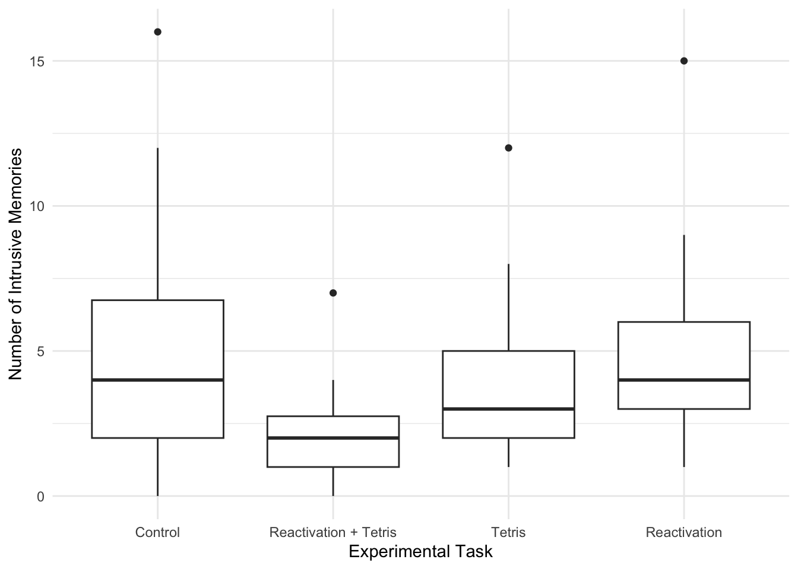
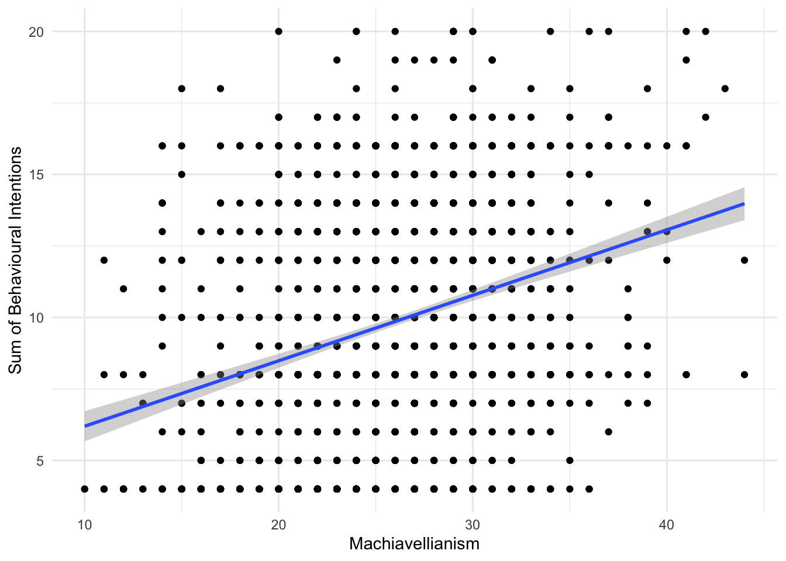
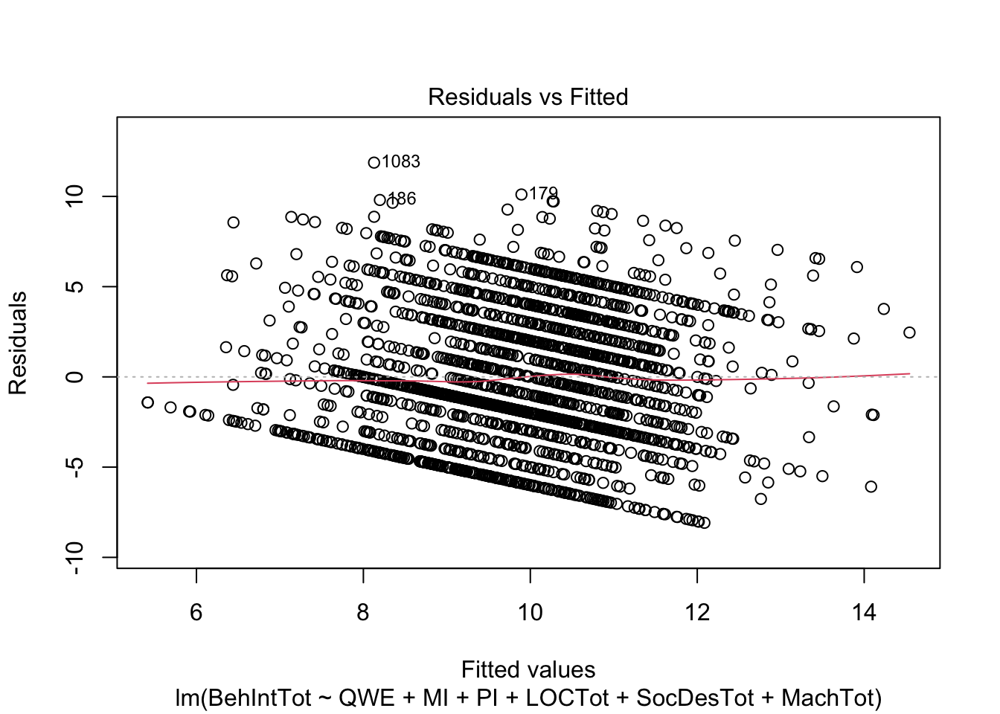
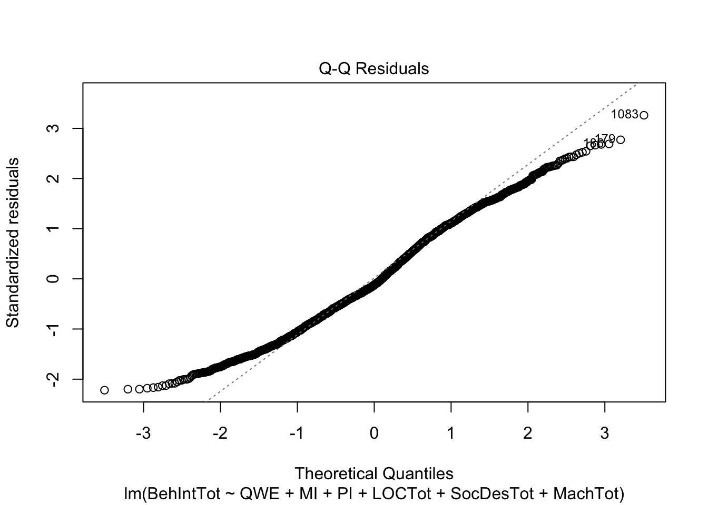
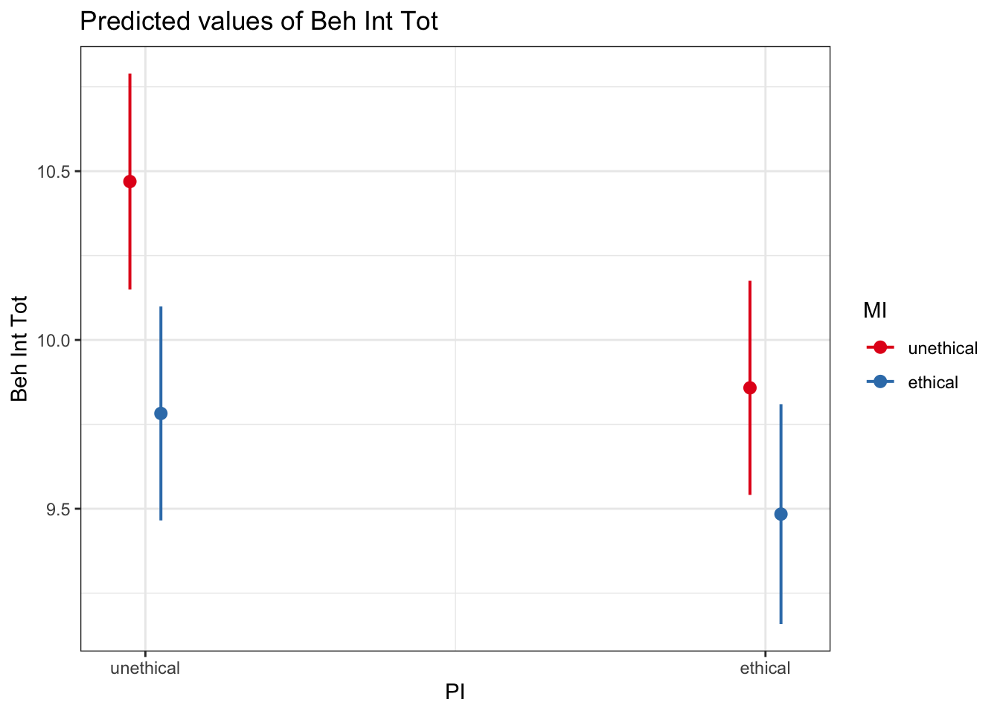
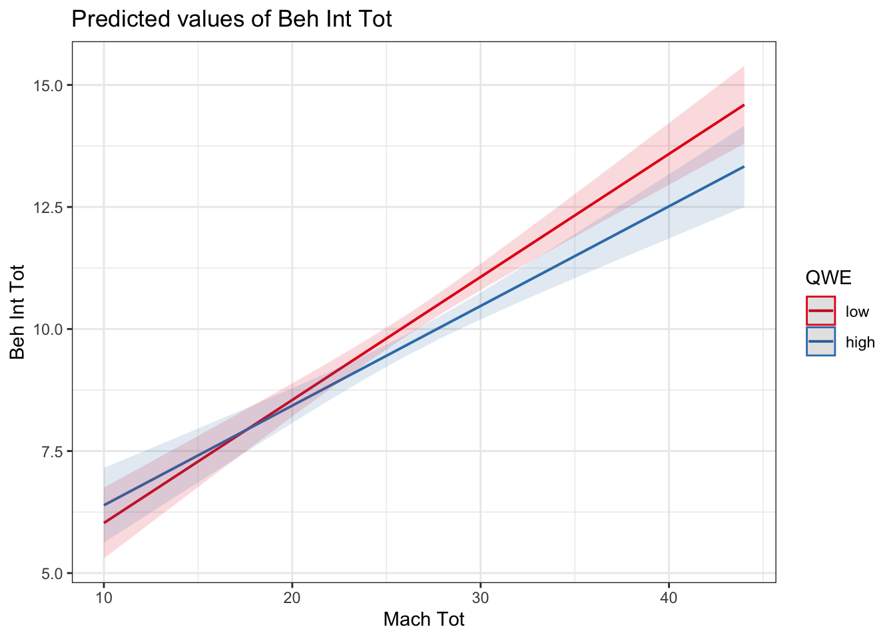

# Multiple Linear Regression

In this chapter, we build on the chapter 1 content where you learnt about the general linear model and applied it to the case of simple linear regression. In this chapter, we will extend that framework for when you want to want to include multiple predictor variables and interactions between predictors. We will cover concepts like standardised and unstandardised predictors, and different coding schemes for predictor variables.  

## Learning objectives

By the end of this chapter, you should be able to: 

1. Understand [different predictor coding schemes](#coding-schemes).

2. Understand the difference between [unstandardised and standardised beta coefficients](#standardised-betas).

3. Understand how to run and interpret a regression for multiple predictors.

4. Understand how to run and interpret a regression containing interaction terms.

To follow along to this chapter and try the code yourself, please download the data files we will be using in [this zip file](data/02_data.zip).

## Packages and the data sets

We first need to load some packages and the data for this task. If you do not have any of the packages, make sure you install them first.


```r
# wrangling and visualisation functions 
library(tidyverse)
# Regression interaction plots
library(sjPlot)
# Standardise model coefficients
library(effectsize)
# VIF and other regression functions
library(car)
# Interaction estimates
library(emmeans)

# Load data for coding schemes
james_data <- read_csv("data/James_2015.csv") %>% 
  mutate(Condition = as.factor(Condition)) %>% 
  rename(post_intrusions = Days_One_to_Seven_Number_of_Intrusions)

# Load data for multiple linear regression
evans_data <- read_csv("data/Evans_2023.csv") %>% 
  mutate(QWE = factor(QWE, levels = c("low", "high")),
         MI = factor(MI, levels = c("unethical", "ethical")),
         PI = factor(PI, levels = c("unethical", "ethical")))
```

## Different predictor coding schemes{#coding-schemes}

### Introduction to the dataset

For the guided examples, we have two datasets, but we will introduce them in turn. To demonstrate different predictor coding schemes, we will use data from @james_computer_2015 who wanted to find non-pharmacological interventions for reducing intrusive memories of traumatic events. They compared four conditions: 

1. No-task control: Participants completed a 10-minute filler task.

2. Reactivation + Tetris: Participants were shown a series of images from a trauma film to
reactivate traumatic memories. After a filler task, participants played Tetris for 12 minutes.

3. Tetris Only: Participants played Tetris for 12 minutes in isolation. 

4. Reactivation Only: Participants completed the reactivation task in isolation. 

Their research question was: Would the reactivation and Tetris condition lead to fewer intrusive memories? They predicted the reactivation and Tetris group will have fewer intrusive memories in the week after experimental trauma exposure compared to the other three groups. 

This means there is one predictor variable `Condition` with four levels, one for each experimental condition. We then have one outcome variable `post_intrusions` for the number of intrusive memories they recorded in the week after the experiment. To support the hypothesis, `post_intrusions` should decrease in group 2 compared to the three other groups. 

### Exploratory data analysis

When starting any data analysis, it is important to visualise the data for some exploratory data analysis. Using the skills you developed in data skills for reproducible research, you can explore the data to understand its properties and look for potential patterns. We can create a boxplot to get a brief overview of how the number of intrusive memories changes across the four condition groups.


```r
james_data %>% 
  ggplot(aes(x = Condition, y = post_intrusions)) + 
  geom_boxplot() + 
  scale_y_continuous(name = "Number of Intrusive Memories") +
  scale_x_discrete(name = "Experimental Task", label = c("Control", "Reactivation + Tetris", "Tetris", "Reactivation")) + 
  theme_minimal()
```



We can see group 2 (reactivation + Tetris) has the lowest score, but we need inferential statistics to test the hypothesis. 

### No specific coding

For a starting point, we can see what it looks like if you enter `post_intrusions` as the outcome and `Condition` as the predictor in simple linear regression with no specific coding scheme.


```r
james_nocoding <- lm(post_intrusions ~ Condition, data = james_data)

summary(james_nocoding)
```

```
## 
## Call:
## lm(formula = post_intrusions ~ Condition, data = james_data)
## 
## Residuals:
##     Min      1Q  Median      3Q     Max 
## -5.1111 -1.8889 -0.8333  1.1111 10.8889 
## 
## Coefficients:
##             Estimate Std. Error t value Pr(>|t|)    
## (Intercept)   5.1111     0.7485   6.828 2.89e-09 ***
## Condition2   -3.2222     1.0586  -3.044  0.00332 ** 
## Condition3   -1.2222     1.0586  -1.155  0.25231    
## Condition4   -0.2778     1.0586  -0.262  0.79381    
## ---
## Signif. codes:  0 '***' 0.001 '**' 0.01 '*' 0.05 '.' 0.1 ' ' 1
## 
## Residual standard error: 3.176 on 68 degrees of freedom
## Multiple R-squared:  0.1434,	Adjusted R-squared:  0.1056 
## F-statistic: 3.795 on 3 and 68 DF,  p-value: 0.01409
```

Although we use `Condition` as a single predictor, we actually get three different predictors. In regression, it can only compare two groups at a time, so it will apply dummy coding to your groups. You get *k*-1 predictors, where there will be one fewer predictor than there are groups. 

Using what you learnt in chapter 1, we can see its a significant model, but the only significant predictor is `Condition2`. Group 1 is the reference group as the intercept, so `Condition2` tells you the mean difference between group 1 and group 2. We compare each group successively to the reference, so `Condition3` is the mean difference between group 1 and group 3 etc.  

### Dummy coding `Condition`

To demonstrate different coding schemes, we will start with dummy coding. Dummy coding is the default in R and when we entered `Condition` as a predictor, this is what R does behind the scenes. However, we have no control over the process and the reference group/intercept will be first in numerical or alphabetical order, then each successive *k*-1 group will be added as separate predictors.

Instead, we can define our own dummy coding to control the reference and target groups. This is particularly useful when you have specific hypotheses like in @james_computer_2015, as we are interested in the combined reactivation and Tetris group (group 2). This means we can code for condition 2 as the reference group / intercept, and the other groups are coded as individual predictors. 

For dummy coding, you will have *k*-1 predictors, meaning one fewer predictor than the number of groups. Since we have four groups, we will need to create three predictors. In the code below, our reference group will always be set to 0. Then, for each dummy coded predictor, we will set the target group to 1. Each target group will be 1 for when it is a predictor, but reactivation and Tetris (condition 2) will always be set to 0. 


```r
# Dummy code condition 2 as 0 for each comparison, and each successive group as 1
james_data <- james_data %>% 
  # For each group at a time, code as 1, with the default set to 0 for all other groups
  mutate(RT_control = case_when(Condition == 1 ~ 1, .default = 0),
         RT_tetris = case_when(Condition == 3 ~ 1, .default = 0),
         RT_reactivation = case_when(Condition == 4 ~ 1, .default = 0))
```

We can get an overview of how this looks by checking the distinct values against `Condition`. 


```r
james_data %>% 
  distinct(Condition, RT_control, RT_tetris, RT_reactivation)
```

<div class="kable-table">

|Condition | RT_control| RT_tetris| RT_reactivation|
|:---------|----------:|---------:|---------------:|
|1         |          1|         0|               0|
|2         |          0|         0|               0|
|3         |          0|         1|               0|
|4         |          0|         0|               1|

</div>

The three predictors show how each comparison is dummy coded. For `RT_control`, group 1 is coded 1 and all the others are coded 0. For `RT_tetris`, group 3 is coded 1 and all the others are coded 0 etc. Group is the only one without ever being coded 1. 

::: {.info data-latex=""}
Remember the interpretation of the intercept is what the outcome value is when the predictors are set to 0. Setting all the predictors to 0 would indicate group 2 in this case, so that represents our reference group. See the predictors as little switches to turn on and off, and when they are all turned off (0), that represents the reference group. 
:::

We can now see what this looks like as our regression model containing dummy coded predictors. 


```r
james_dummy <- lm(post_intrusions ~ RT_control + RT_tetris + RT_reactivation, data = james_data)

summary(james_dummy)
```

```
## 
## Call:
## lm(formula = post_intrusions ~ RT_control + RT_tetris + RT_reactivation, 
##     data = james_data)
## 
## Residuals:
##     Min      1Q  Median      3Q     Max 
## -5.1111 -1.8889 -0.8333  1.1111 10.8889 
## 
## Coefficients:
##                 Estimate Std. Error t value Pr(>|t|)   
## (Intercept)       1.8889     0.7485   2.523  0.01396 * 
## RT_control        3.2222     1.0586   3.044  0.00332 **
## RT_tetris         2.0000     1.0586   1.889  0.06312 . 
## RT_reactivation   2.9444     1.0586   2.781  0.00700 **
## ---
## Signif. codes:  0 '***' 0.001 '**' 0.01 '*' 0.05 '.' 0.1 ' ' 1
## 
## Residual standard error: 3.176 on 68 degrees of freedom
## Multiple R-squared:  0.1434,	Adjusted R-squared:  0.1056 
## F-statistic: 3.795 on 3 and 68 DF,  p-value: 0.01409
```

This gives us a similar result to before, some of the coefficients are even the same, but we are controlling what the reference group is for the intercept, and what each target comparison is. They are all positive predictors showing the number of intrusive memories is higher in each control group compared to the combined reactivation and Tetris group. However, the difference to Tetris in isolation is not statistically significant. 

For these initial steps, it is also a good opportunity to sense check how the comparisons work. The intercept is the mean for our reference group - reactivation plus Tetris. Each coefficient is then the mean difference for each target group against the reference. We can show this is the case by comparing the means. 


```r
# Calculate and isolate the mean for group 2 as our reference group
RT_mean <- james_data %>% 
  # Isolate group 2
  filter(Condition == 2) %>% 
  summarise(mean_intrusions = mean(post_intrusions)) %>% 
  # Isolate the first value
  pluck(1)

# For each other group, calculate the mean difference between the group mean and RT mean
james_data %>% 
  # Omit group 2
  filter(Condition != 2) %>% 
  # Get mean difference for all other groups
  group_by(Condition) %>% 
  summarise(mean_difference = mean(post_intrusions) - RT_mean)
```

<div class="kable-table">

|Condition | mean_difference|
|:---------|---------------:|
|1         |        3.222222|
|3         |        2.000000|
|4         |        2.944444|

</div>

::: {.warning data-latex=""}
We can see the mean for group 2 and the mean differences align with exactly what we expect. It is important to work through the process now as the group means align with the model estimates. This will not be the case when we have multiple predictors since the coefficients become partial effects. 
:::

### Deviation coding `Condition`

Finally, we have deviation coding. This is more useful once we get to interactions later, but it is easier to see the logic behind what it is doing when we have no other predictors to worry about. 

Remember, in dummy coding, the intercept is the reference group mean, and each dummy coded predictor is the mean difference against the reference group. 

In deviation coding, the interpretation of the intercept changes to be the grand mean of all observations, i.e., taking the mean of all four groups. The coefficients are then the difference between each comparison group with the grand mean for a main effect. We still need to create a new predictor for *k*-1 groups, but instead of coding 0 and 1, we use 0.5 and -0.5. 

You might see different ways of deviation coding. When you use 0.5/-0.5, you can calculate the effect of the group as 0.5 * the slope, which tells you the difference to the grand mean. For 1/-1. you calculate the effect of the group as 1 * the slope, which tells you the difference to the grand mean. We will typically use 0.5/-0.5 for consistency with other materials, but be aware you might see each approach.
 

```r
# Create deviation coding for k-1 groups
# In this method, group 2 as our reference will be -0.5 in each comparison. 
# Variables not included in the predictor are set to 0
# The target group is set to 0.5 for each predictor
james_data <- james_data %>% 
  mutate(control_deviation = case_when(Condition == 1 ~ 0.5,
                                       Condition %in% c(3, 4) ~ 0,
                                       Condition == 2 ~ -0.5),
         tetris_deviation = case_when(Condition == 3 ~ 0.5,
                                       Condition %in% c(1, 4) ~ 0,
                                       Condition == 2 ~ -0.5),
         reactivation_deviation = case_when(Condition == 4 ~ 0.5,
                                       Condition %in% c(1, 3) ~ 0,
                                       Condition == 2 ~ -0.5))
```

As before, we can get an overview of how this looks by checking the distinct values against `Condition`. 


```r
james_data %>% 
  distinct(Condition, control_deviation, tetris_deviation, reactivation_deviation)
```

<div class="kable-table">

|Condition | control_deviation| tetris_deviation| reactivation_deviation|
|:---------|-----------------:|----------------:|----------------------:|
|1         |               0.5|              0.0|                    0.0|
|2         |              -0.5|             -0.5|                   -0.5|
|3         |               0.0|              0.5|                    0.0|
|4         |               0.0|              0.0|                    0.5|

</div>

The three predictors show how each comparison is deviation coded. For `control_deviation`, group 1 is coded 0.5, the predictors to ignore are coded 0, and the target group is coded -0.5. For `tetris_deviation`, group 3 is coded 0.5 etc. Group 2 is always coded -0.5 in this case. 

::: {.info data-latex=""}
Remember the interpretation of the intercept is what the outcome value is when the predictors are set to 0. The interpretation shifts here as the intercept represents the grand mean across the group. When the predictors are set to 0, the outcome is in the middle of -0.5 and 0.5, so its the mid point or average. When you do not have interactions, this might not be as useful, but its easier to understand the logic when there are no partial effects.  
:::

We can now see what this looks like for our regression model containing deviation coded predictors. 


```r
james_deviation <- lm(post_intrusions ~ control_deviation + tetris_deviation + reactivation_deviation, data = james_data)

summary(james_deviation)
```

```
## 
## Call:
## lm(formula = post_intrusions ~ control_deviation + tetris_deviation + 
##     reactivation_deviation, data = james_data)
## 
## Residuals:
##     Min      1Q  Median      3Q     Max 
## -5.1111 -1.8889 -0.8333  1.1111 10.8889 
## 
## Coefficients:
##                        Estimate Std. Error t value Pr(>|t|)    
## (Intercept)             3.93056    0.37427  10.502 7.11e-16 ***
## control_deviation       2.36111    1.29652   1.821    0.073 .  
## tetris_deviation       -0.08333    1.29652  -0.064    0.949    
## reactivation_deviation  1.80556    1.29652   1.393    0.168    
## ---
## Signif. codes:  0 '***' 0.001 '**' 0.01 '*' 0.05 '.' 0.1 ' ' 1
## 
## Residual standard error: 3.176 on 68 degrees of freedom
## Multiple R-squared:  0.1434,	Adjusted R-squared:  0.1056 
## F-statistic: 3.795 on 3 and 68 DF,  p-value: 0.01409
```

This time, the results look a little different. None of the coefficients are significant, but importantly, the model is exactly the same. We are still explaining the same amount of variance in the outcome, but the way we are expressing it is different. 

Deviation coding is tricky at first to appreciate what its doing, so working through the logic is even more important than for dummy coding. This time, we need to calculate the grand mean of all observations, then compare the coefficients against the grand mean. 


```r
# Calculate and isolate the grand mean of all groups
grand_mean <- james_data %>% 
  summarise(mean_intrusions = mean(post_intrusions)) %>% 
  pluck(1)

# Calculate the mean number of intrusions for each group
# Then calculate the deviations as 2 times the mean difference 
james_data %>% 
  group_by(Condition) %>% 
  summarise(mean_intrusions = mean(post_intrusions),
            deviations = (grand_mean - mean(post_intrusions)) * 2)
```

<div class="kable-table">

|Condition | mean_intrusions| deviations|
|:---------|---------------:|----------:|
|1         |        5.111111| -2.3611111|
|2         |        1.888889|  4.0833333|
|3         |        3.888889|  0.0833333|
|4         |        4.833333| -1.8055556|

</div>

::: {.warning data-latex=""}
We can see the grand mean and deviations align with exactly what we expect. It is trickier than dummy coding, but this is what deviation coding does. Note in the model you do not get the group 2 contrast as that's always the reference group and we are ignoring the sign of the deviation to check its consistency. Also pay attention to calculating 2 times the difference, since we used 0.5/-0.5 as the coding scheme. 

It is important to work through the process now as the deviations align with the model estimates. This will not be the case when we have multiple predictors since the coefficients become partial predictors. 
:::

### Unstandardised vs standardised betas{#standardised-betas}

In this final demonstration, we will use this data set as an opportunity to demonstrate the difference between unstandardised and standardised beta coefficients. 

When you use the raw data, the interpretation of the intercept and slopes relates to the units of measurement. So, how your outcome changes for a 1 unit change in your predictor. That 1 unit will be relative to the units of measurement and the interpretation changes depending on what your variables are. 

When you have multiple predictors, the units might be different in each predictor, so it can be difficult to judge which predictor has the biggest impact. Alternatively, standardising predictors is comparable to Cohen's d when you compare groups which you see all the time in psychology. 

You can do this manually by scaling all the variables. This means you transform each variable to have a mean of 0 and standard deviation of 1. Instead of being in the raw units, the units are expressed in standard deviations. 


```r
# Select our four variables of interest for the dummy coded version of the model
standardise_variables <- james_data %>% 
  select(post_intrusions, RT_control, RT_tetris, RT_reactivation)

# Standardise the variables by using the scale() function on them
# There are two layers here as scale() saves the variables just as a matrix, so we need to store it in a data frame
standardise_variables <- data.frame(scale(standardise_variables))

# See what the standardised variables look like
head(standardise_variables)
```

<div class="kable-table">

| post_intrusions| RT_control|  RT_tetris| RT_reactivation|
|---------------:|----------:|----------:|---------------:|
|       0.0206797|   1.719981| -0.5733269|      -0.5733269|
|      -0.2771082|   1.719981| -0.5733269|      -0.5733269|
|       0.6162555|   1.719981| -0.5733269|      -0.5733269|
|      -0.5748961|   1.719981| -0.5733269|      -0.5733269|
|      -0.2771082|   1.719981| -0.5733269|      -0.5733269|
|       0.0206797|   1.719981| -0.5733269|      -0.5733269|

</div>

We can now refit the dummy-coded model using the standardised version of the data set. All the predictor and outcome names remained the same. 


```r
standardised_dummy <- lm(post_intrusions ~ RT_control + RT_tetris + RT_reactivation, data = standardise_variables)

# Temporarily turn off scientific notation so we can see the numbers clearer
options(scipen = 15)
summary(standardised_dummy)
# Turn scientific notation back on to stop everything else printing to loads of decimals
options(scipen = 0)
```

```
## 
## Call:
## lm(formula = post_intrusions ~ RT_control + RT_tetris + RT_reactivation, 
##     data = standardise_variables)
## 
## Residuals:
##     Min      1Q  Median      3Q     Max 
## -1.5220 -0.5625 -0.2482  0.3309  3.2426 
## 
## Coefficients:
##                                Estimate              Std. Error t value
## (Intercept)     -0.00000000000000005042  0.11145399933614341670   0.000
## RT_control       0.41840827520580753385  0.13746063961845123025   3.044
## RT_tetris        0.25970168805877702489  0.13746063961845123025   1.889
## RT_reactivation  0.38233859630875477453  0.13746063961845117474   2.781
##                 Pr(>|t|)   
## (Intercept)      1.00000   
## RT_control       0.00332 **
## RT_tetris        0.06312 . 
## RT_reactivation  0.00700 **
## ---
## Signif. codes:  0 '***' 0.001 '**' 0.01 '*' 0.05 '.' 0.1 ' ' 1
## 
## Residual standard error: 0.9457 on 68 degrees of freedom
## Multiple R-squared:  0.1434,	Adjusted R-squared:  0.1056 
## F-statistic: 3.795 on 3 and 68 DF,  p-value: 0.01409
```

Instead of the original units, our coefficients are now expressed as a standardised mean difference. This means instead of the reference group having an average of 3.22 fewer intrusive memories than control, the difference was 0.42 standard deviations. Standardised units are reported all the time in psychology as its easier to compare studies using different measures, but its important the measures and comparisons are comparable to make sense. 

Now you know the logic behind standardising predictors and how it works, there is a shortcut you can use to standardise the estimates of a model you have already created. The <code class='package'>effectsize</code> package has a handy function called <code><span><span class='fu'>standardize_parameters</span><span class='op'>(</span><span class='op'>)</span></span></code> which will refit a model and return standardised estimates, helpfully also including the 95% CI around the estimates. 


```r
standardize_parameters(james_dummy)
```

<div class="kable-table">

|Parameter       | Std_Coefficient|   CI|     CI_low|   CI_high|
|:---------------|---------------:|----:|----------:|---------:|
|(Intercept)     |       0.0000000| 0.95| -0.2224030| 0.2224030|
|RT_control      |       0.4184083| 0.95|  0.1441098| 0.6927067|
|RT_tetris       |       0.2597017| 0.95| -0.0145967| 0.5340001|
|RT_reactivation |       0.3823386| 0.95|  0.1080402| 0.6566370|

</div>

Reassuringly, we get the same estimates as when we converted the variables ourselves. 

## Multiple linear regression with individual predictors

### Introduction to the dataset

To demonstrate multiple linear regression models, we will use data from @evans_unethical_2024 (the stage two manuscript is currently under review) who performed a multi-site registered replication report containing 2218 participants. They wanted to replicate @jones_experimental_1996 - an influential study in organisational psychology on unethical workplace behaviour. The variables can be split into two types. The first are situational factors and relate to experimental manipulations on a vignette that participants read:

1. Workplace environment (`QWE`): Your workplace environment is described as high or low quality. 

2. Manager influence (`MI`): Your manager is described as behaving ethically or unethically. 

3. Peer influence (`PI`): Your peers are described as behaving ethically or unethically. 

The second group of variables are individual and relate to the participant rather than being experimentally manipulated: 

1. Locus of control (`LOCTot`): A measure of whether someone attributes events internally or externally. 

2. Social desirability (`SocDesTot`): A measure of whether someone would respond in a way that would make them look better than they would typically act. 

3. Machiavellianism (`MachTot`): A personality trait that is part of the dark-triad, showing a lack of empathy and willingness to manipulate others. 

The outcome in the study was then the participant's unethical workplace behaviour intention (`BehIntTot`). The vignette described a situation in a company and the unethical behaviour was whether you would manipulate expense requests to claim more money than you really should. There were four questions which were added up to range from 4 to 20, with higher values meaning greater intention to behave unethically.  

Our research question for this study is: What is the effect of individual and situational factors on unethical workplace behaviour intentions? We will not pose specific hypotheses, but we essentially predict that these six factors will affect someone's unethical workplace behaviour intention. 

### Visualise the relationship 

When starting any data analysis, it is important to visualise the data for some exploratory data analysis. Using the skills you developed in data skills for reproducible research, explore the data understand its properties and look for potential patterns. 

Please try this yourself and explore different variables and their relationship to unethical workplace behaviour. For example, we can look at the effect of quality of workplace environment: 


```r
evans_data %>% 
  ggplot(aes(x = QWE, y = BehIntTot)) + 
  geom_boxplot() + 
  scale_y_continuous(name = "Sum of Behavioural Intentions") +
  scale_x_discrete(name = "Quality of Workplace Environment", label = c("Low", "High")) +
  theme_minimal()
```


Alternatively, we might look at the relationship between unethical behaviour intention and Machiavellianism: 


```r
evans_data %>% 
  ggplot(aes(x = MachTot, y = BehIntTot)) + 
  geom_point() + 
  geom_smooth(method = "lm") + 
  scale_y_continuous(name = "Sum of Behavioural Intentions") +
  scale_x_continuous(name = "Machiavellianism") +
  theme_minimal()
```



### Model 1: Situational factors

Now you understand the data a little better, it is time to apply our modelling techniques to address our research question. We will go with the hierarchical approach to entering predictors to enter them in two steps. First, situational factors, then the individual factors on top of them. 


```r
individual_model1 <- lm(BehIntTot ~ QWE + MI + PI, data = evans_data)

summary(individual_model1)
```

```
## 
## Call:
## lm(formula = BehIntTot ~ QWE + MI + PI, data = evans_data)
## 
## Residuals:
##     Min      1Q  Median      3Q     Max 
## -6.5855 -2.5855 -0.5956  2.9452 10.3357 
## 
## Coefficients:
##             Estimate Std. Error t value Pr(>|t|)    
## (Intercept)  10.5855     0.1628  65.018  < 2e-16 ***
## QWEhigh      -0.3905     0.1629  -2.397  0.01663 *  
## MIethical    -0.5307     0.1630  -3.256  0.00115 ** 
## PIethical    -0.4592     0.1630  -2.817  0.00488 ** 
## ---
## Signif. codes:  0 '***' 0.001 '**' 0.01 '*' 0.05 '.' 0.1 ' ' 1
## 
## Residual standard error: 3.837 on 2214 degrees of freedom
## Multiple R-squared:  0.01068,	Adjusted R-squared:  0.009341 
## F-statistic: 7.968 on 3 and 2214 DF,  p-value: 2.774e-05
```
All three predictors are statistically significant and are all negative. Since we coded the positive manipulations as the target groups, this shows people reported lower unethical workplace behaviour intentions in the high/ethical groups. 

We explain a significant amount of variance in unethical behaviour intentions, but note the $R^2$ and adjusted $R^2$ values. They are approximately .01 or 1%, showing with 2000 plus participants, we can reject the null, but we explain only a modest proportion of variance. 

At this point, it is an important lesson to see how the presence of other predictors affects the estimates of another predictor. For a demonstration, we will create another regression model, but only including one situational variable at a time. Feel free to create the other two yourself and compare.


```r
individual_model1a <- lm(BehIntTot ~ QWE, data = evans_data)

summary(individual_model1a)
```

```
## 
## Call:
## lm(formula = BehIntTot ~ QWE, data = evans_data)
## 
## Residuals:
##     Min      1Q  Median      3Q     Max 
## -6.0938 -2.0938 -0.7052  2.9062 10.2948 
## 
## Coefficients:
##             Estimate Std. Error t value Pr(>|t|)    
## (Intercept)  10.0938     0.1151  87.685   <2e-16 ***
## QWEhigh      -0.3886     0.1635  -2.377   0.0176 *  
## ---
## Signif. codes:  0 '***' 0.001 '**' 0.01 '*' 0.05 '.' 0.1 ' ' 1
## 
## Residual standard error: 3.851 on 2216 degrees of freedom
## Multiple R-squared:  0.002542,	Adjusted R-squared:  0.002092 
## F-statistic: 5.648 on 1 and 2216 DF,  p-value: 0.01756
```

::: {.info data-latex=""}
If you compare the coefficient for QWE in model 1 to this new isolated model, we get slightly different estimates. Its close, but not exactly the same. That is because in a multiple linear regression model, the predictors become partial effects. We are trying to model different sources of variance, so what might be explained by a predictor in one model, might change in a model with additional predictors. So, you might find predictors that are significant in one model are no longer significant in another model. 
:::

### Model 2: Situational and individual factors

Now we have explored the effect of situational factors on unethical behaviour intentions, we can add the individual factors to see how well they contribute to the model. 


```r
individual_model2 <- lm(BehIntTot ~ QWE + MI + PI + LOCTot + SocDesTot + MachTot, data = evans_data)

summary(individual_model2)
```

```
## 
## Call:
## lm(formula = BehIntTot ~ QWE + MI + PI + LOCTot + SocDesTot + 
##     MachTot, data = evans_data)
## 
## Residuals:
##     Min      1Q  Median      3Q     Max 
## -8.0856 -2.7105 -0.4456  2.8414 11.8721 
## 
## Coefficients:
##             Estimate Std. Error t value Pr(>|t|)    
## (Intercept)  7.61519    1.00062   7.610 4.02e-14 ***
## QWEhigh     -0.41735    0.15513  -2.690  0.00719 ** 
## MIethical   -0.47421    0.15532  -3.053  0.00229 ** 
## PIethical   -0.39941    0.15526  -2.572  0.01016 *  
## LOCTot       0.02330    0.01687   1.381  0.16744    
## SocDesTot   -0.08860    0.01984  -4.467 8.35e-06 ***
## MachTot      0.18967    0.01773  10.697  < 2e-16 ***
## ---
## Signif. codes:  0 '***' 0.001 '**' 0.01 '*' 0.05 '.' 0.1 ' ' 1
## 
## Residual standard error: 3.652 on 2211 degrees of freedom
## Multiple R-squared:  0.1049,	Adjusted R-squared:  0.1025 
## F-statistic: 43.19 on 6 and 2211 DF,  p-value: < 2.2e-16
```

With three more variables, we explain a larger proportion of variance. Before, adjusted $R^2$ was around 1%, now it is .10 or 10%. So adding these situational variables seem to explain a larger chunk of variance. All the predictors apart from locus of control are statistically significant. Almost all the significant predictors are negative, suggesting lower unethical behaviour intention, apart from Machiavellianism. This makes sense as it means higher in a personality trait for unempathic behaviour is associated with higher intention for unethical behaviour. 

#### Standardised coefficients

At this point with a mix of predictors, we can also check the standardised coefficients to see which predictors appear to be the strongest on a standard deviation scale. 


```r
standardize_parameters(individual_model2)
```

<div class="kable-table">

|Parameter   | Std_Coefficient|   CI|     CI_low|    CI_high|
|:-----------|---------------:|----:|----------:|----------:|
|(Intercept) |       0.1659965| 0.95|  0.0871282|  0.2448649|
|QWEhigh     |      -0.1082689| 0.95| -0.1871863| -0.0293515|
|MIethical   |      -0.1230192| 0.95| -0.2020337| -0.0440047|
|PIethical   |      -0.1036139| 0.95| -0.1826004| -0.0246273|
|LOCTot      |       0.0296680| 0.95| -0.0124626|  0.0717985|
|SocDesTot   |      -0.0989384| 0.95| -0.1423766| -0.0555001|
|MachTot     |       0.2421870| 0.95|  0.1977892|  0.2865848|

</div>

Machiavellianism seems to be the strongest predictor here, showing for every 1 standard deviation increase in Machiavellianism, we expect unethical behaviour intentions to increase by 0.24 standard deviations. 

#### Checking assumptions

At this point, we can check whether there any red flags by checking the assumption plots. Remember, in multiple linear regression, we want: 

- The outcome is interval/ratio level data 

- The predictor variables are interval/ratio or categorical (with two levels at a time)

- All values of the outcome variable are independent (i.e., each score should come from a different participant/observation)

- The predictors have non-zero variance

- The relationship between the outcome and predictors is linear

- The residuals should be normally distributed

- There should be homoscedasticity


```r
plot(individual_model2)
```



There do not appear to be any major red flags (apart from discrete looking data which we will get onto). Plots 1 and 3 show homoscedasticity as the residuals are roughly consistent across the x-axis. The qq plot in plot 2 is fine, just with values at the lower and upper scale moving away from the line. Combined with plots 1 and 3, there are characteristic signs that the outcome may not be truly interval. The residuals are organised into lines as remember our outcome is the sum of a Likert question, so there are only so many possible values. We will come back to this idea in chapter 3. Finally, plot 4 is not flagging any observations as high in leverage for potential outliers. 

So far, this is the same as chapter 1. We have a new assumption to check when we have multiple predictors though. We do not want predictors to be too heavily correlated with each other, known as multicollinearity. We can check this using a function from <code class='package'>car</code> called <code><span><span class='fu'>vif</span><span class='op'>(</span><span class='op'>)</span></span></code>.


```r
vif(individual_model2)
```

```
##       QWE        MI        PI    LOCTot SocDesTot   MachTot 
##  1.000447  1.002926  1.002201  1.140099  1.211972  1.266108
```

VIF stands for variance inflation factor and a conservative estimate is values that are less than 2.5 are fine. Values above 2.5 suggest your predictors are too heavily correlated. Some people suggest less than 10 is OK, but siding with caution is normally a good approach. Here, the highest value is 1.27, so it does not look like there is anything to worry about. 

### Model comparison 

Now we have two competing models, we can see whether model 2 is the better fitting model and is worth adding three additional predictors in. We are trying to avoid overfitting as $R^2$ will almost always increase with more variables, but it might not be actually doing anything worthwhile. 

#### Comparing models using `anova()`

First, we can compare the two models using analysis of variance (ANOVA) to see whether model 2 explains significantly more variance than model 1. 


```r
anova(individual_model1, individual_model2)
```

<div class="kable-table">

| Res.Df|      RSS| Df| Sum of Sq|       F| Pr(>F)|
|------:|--------:|--:|---------:|-------:|------:|
|   2214| 32591.48| NA|        NA|      NA|     NA|
|   2211| 29487.44|  3|   3104.04| 77.5814|      0|

</div>

It does seem to be the case here. Careful of the rounding as the *p*-value is tiny and its rounded to 0 in the rendering of the book. The difference between the models is statistically significant, suggesting model 2 explains more variance than model 1. 

#### Comparing R2 for each model

Second, we can compare $R^2$ for each model to see if model 2 explains more variance in our outcome than model 1. This is more of a prompt to look at your two model objects and compare the values. 

Remember, adjusted $R^2$ is particularly useful here as it corrects for model complexity. It penalises for the number of predictors in your model, so there will be a bigger difference in $R^2$ and adjusted $R^2$ when the model is unnecessarily complex. This also supports our case as adjusted $R^2$ increase from approximately .01 to .10. 

#### Checking model fit using AIC

Finally, we can check the Akaike Information Criterion (AIC) as a measure of model fit. It calculates prediction error in the model and it can only be interpreted as a relative value. There is not an inherent good or bad threshold, its relative to the data and models you are working with. 

As it represents prediction error, lower AIC values mean better model fit relative to another model. If a more complicated model has a higher AIC than a less complicated model, there is potential overfitting when you have redundant predictors, so its better to retain the less complex model. 


```r
AIC(individual_model1)

AIC(individual_model2)
```

```
## [1] 12265.16
## [1] 12049.17
```
The AIC value decreases in model 2, suggesting that although we have a more complex model, the additional predictors are not redundant, there is less prediction error and we are learning something useful by including these extra predictors. 

## Multiple linear regression with interactions

Finally, we will explore how you can express different types of interactions in multiple linear regression models. 

### Coding schemes for interactions

At the start of this chapter and previously in chapter 1, we explored different coding schemes for predictors. For continuous predictors, we can enter variables as raw or centered values. For categorical predictors, we can enter variables as dummy or deviation coded values. 

When you have multiple linear regression models, changing the coding scheme does little else but helps you interpret the intercept. However, once you start adding interaction terms, it is super important to know the difference between what the coefficients mean when you center the predictors or not. 

In preparation for later, lets deviation code the categorical variables and center the continuous variables. 


```r
evans_data <- evans_data %>% 
  # Start by deviation coding the categorical variables as 0.5 and -0.5
  mutate(QWE_deviation = case_when(QWE == "high" ~ 0.5, .default = -0.5),
         MI_deviation = case_when(MI == "ethical" ~ 0.5, .default = -0.5),
         PI_deviation = case_when(PI == "ethical" ~ 0.5, .default = -0.5),
         # Then center the continuous predictors by subtracting the mean
         LOCTot_center = LOCTot - mean(LOCTot),
         SocDesTot_center = SocDesTot - mean(SocDesTot),
         MachTot_center = MachTot - mean(MachTot))
```

### Categorical by categorical interactions

We will demonstrate these principles by focusing on two predictors at a time, but note these concepts just add onto to everything you learnt so far. You could have just two interacting predictors, or you could have a mix of individual and interacting predictors. 

First, we will explore categorical by categorical interactions. This looks at the moderating effect of one predictor on the difference in the outcome between levels of another predictor. 

#### Dummy coded predictors

For a starting point, let's look at what the model looks like for our original dummy coded predictors. Previously, we separated predictors with +, but to get the interaction between predictors, we use * instead. 


```r
interaction_model1_dummy <- lm(BehIntTot ~ MI * PI, data = evans_data)

summary(interaction_model1_dummy)
```

```
## 
## Call:
## lm(formula = BehIntTot ~ MI * PI, data = evans_data)
## 
## Residuals:
##     Min      1Q  Median      3Q     Max 
## -6.4693 -2.4693 -0.4841  3.1418 10.2177 
## 
## Coefficients:
##                     Estimate Std. Error t value Pr(>|t|)    
## (Intercept)          10.4693     0.1632  64.156  < 2e-16 ***
## MIethical            -0.6870     0.2297  -2.992  0.00281 ** 
## PIethical            -0.6112     0.2298  -2.660  0.00787 ** 
## MIethical:PIethical   0.3130     0.3263   0.959  0.33759    
## ---
## Signif. codes:  0 '***' 0.001 '**' 0.01 '*' 0.05 '.' 0.1 ' ' 1
## 
## Residual standard error: 3.841 on 2214 degrees of freedom
## Multiple R-squared:  0.008527,	Adjusted R-squared:  0.007184 
## F-statistic: 6.347 on 3 and 2214 DF,  p-value: 0.0002781
```

::: {.info data-latex=""}
There are different symbols you can use for model formulae. Using * is shorthand for "give me the individual and interaction effects of these variables". You could also specify it fully by using `predictor1 + predictor 2 + predictor1:predictor2`. You can find a full list of formula syntax in places like this <a href="https://www.econometrics.blog/post/the-r-formula-cheatsheet/" target="_blank">Econometrics blog</a>.
:::

Manager influence and peer influence are both significant, but the interaction between them is not statistically significant. 

#### Deviation coded predictors

Compare that to the same model, but using the deviation coded predictors instead. Look at the coefficients for the individual predictors and the interaction. Which are different and which are the same between the models? 


```r
interaction_model1_deviation <- lm(BehIntTot ~ MI_deviation * PI_deviation, data = evans_data)

summary(interaction_model1_deviation)
```

```
## 
## Call:
## lm(formula = BehIntTot ~ MI_deviation * PI_deviation, data = evans_data)
## 
## Residuals:
##     Min      1Q  Median      3Q     Max 
## -6.4693 -2.4693 -0.4841  3.1418 10.2177 
## 
## Coefficients:
##                           Estimate Std. Error t value Pr(>|t|)    
## (Intercept)                9.89847    0.08158 121.341  < 2e-16 ***
## MI_deviation              -0.53053    0.16315  -3.252  0.00116 ** 
## PI_deviation              -0.45467    0.16315  -2.787  0.00537 ** 
## MI_deviation:PI_deviation  0.31297    0.32630   0.959  0.33759    
## ---
## Signif. codes:  0 '***' 0.001 '**' 0.01 '*' 0.05 '.' 0.1 ' ' 1
## 
## Residual standard error: 3.841 on 2214 degrees of freedom
## Multiple R-squared:  0.008527,	Adjusted R-squared:  0.007184 
## F-statistic: 6.347 on 3 and 2214 DF,  p-value: 0.0002781
```

You will see that the model fit and coefficient for the interaction is identical, but the individual predictor coefficients changed. This happens because of the interpretation of the intercept and coefficient in dummy coding. When you dummy code these variables, the intercept is the value for the outcome when both manager influence is unethical and peer influence is unethical. The coefficient for manager influence is then how we expect the outcome to change for ethical managers, when there is an unethical peer influence. These are **simple effects**, which can be useful information, but it might not be what you are expecting. 

In the deviation model, this turns into something more familiar to those working with ANOVA to compare categorical variables. The intercept is the grand mean now, so the individual predictors become **main effects**, or the effect of one predictor, when the second predictor is held constant at 0. For instance, an ethical manager decreases the unethical behaviour intention by 0.35 (0.5 * 0.69 because of the deviation coding scheme) compared to the grand mean. 

Both approaches provide useful information, but think about what information you are looking for. Typically, main effects are more useful when you want to know the individual effect of predictors on the outcome. Simple effects are then normally more useful when you are trying to break down each element of an interaction and you want the conditional effect of one predictor on another. 

Its always about your research question and what information you want to know. 

#### Plotting interactions

In these examples, the dataset is great for a large sample of different variables, but there are not really any meaningful interactions to explore. But, we can still demonstrate what you would do if there *was* an interaction to explore. 

First, plotting is your friend. Sometimes you can plot your design fine using <code class='package'>ggplot2</code>, but you often miss out on the inferential parts for the confidence intervals around estimates, particularly when there are interactions to explore. So, the <code class='package'>sjPlot</code> package can be useful as it can take regression models and plot the model predictions. To decomponse an interaction, it is normally more useful to use the original / dummy-coded variables, as we are interested in the simple effects here, and the units will be more interpretation for the average reader. 


```r
# sjPlot makes it easy to plot estimates from the model
plot_model(interaction_model1_dummy, # You enter the model object
           type = "pred", # The type of plot you want to create
           terms = c("MI", "PI")) # The predictors you want to plot 
```


It is up to you and your research question which way you plot the interaction. You can explore the moderating effect of predictor 1 on predictor 2, or the moderating effect of predictor 2 on predictor 1. You will need to consider which addresses your research question. For example, we can flip it around: 


```r
# sjPlot makes it easy to plot estimates from the model
plot_model(interaction_model1_dummy, # You enter the model object
           type = "pred", # The type of plot you want to create
           terms = c("PI", "MI")) # The predictors you want to plot 
```



<code class='package'>sjPlot</code> is somewhat based on <code class='package'>ggplot2</code>, so the output may not be publication quality immediately, but you can edit some elements like <code class='package'>ggplot2</code>. Annoyingly, its not easy to edit the x-axis and legend labels, so its normally better to edit the underlying variable name and labels instead. 


```r
plot_model(interaction_model1_dummy,
           type = "pred", 
           terms = c("MI", "PI")) + 
  scale_y_continuous(breaks = seq(8, 14, 2), 
                     limits = c(8, 14), 
                     name = "Unethical Workplace Behaviour Intention") + 
  theme_minimal() + 
  labs(title = "")
```

```
## Scale for y is already present.
## Adding another scale for y, which will replace the existing scale.
```


#### Breaking down model estimates

Another way of breaking down interactions is by reporting the estimated marginal means. When there is an interaction, you often want to known whether the mean difference in predictor 1 is different across the levels of predictor 2. Plotting shows you this visually, but you might want to report effect sizes in your write-up. 

The <code class='package'>emmeans</code> package can take a model object and report the estimated marginal means providing you tell it which variables you want to break it down by. Remember, you can switch the order of the variables depending on which predictor you want as the moderator. 

For example, we can report the estimated marginal means and their confidence intervals of all four groups. 


```r
emmeans(interaction_model1_dummy, ~ MI | PI)
```

```
## PI = unethical:
##  MI        emmean    SE   df lower.CL upper.CL
##  unethical  10.47 0.163 2214    10.15    10.79
##  ethical     9.78 0.162 2214     9.47    10.10
## 
## PI = ethical:
##  MI        emmean    SE   df lower.CL upper.CL
##  unethical   9.86 0.162 2214     9.54    10.18
##  ethical     9.48 0.166 2214     9.16     9.81
## 
## Confidence level used: 0.95
```

Or we can report the mean difference moderated by the second predictor by wrapping it in the <code><span><span class='fu'>contrast</span><span class='op'>(</span><span class='op'>)</span></span></code> function. 


```r
contrast(emmeans(interaction_model1_dummy, ~ MI | PI))
```

```
## PI = unethical:
##  contrast         estimate    SE   df t.ratio p.value
##  unethical effect    0.344 0.115 2214   2.992  0.0028
##  ethical effect     -0.344 0.115 2214  -2.992  0.0028
## 
## PI = ethical:
##  contrast         estimate    SE   df t.ratio p.value
##  unethical effect    0.187 0.116 2214   1.614  0.1067
##  ethical effect     -0.187 0.116 2214  -1.614  0.1067
## 
## P value adjustment: fdr method for 2 tests
```

Note you get all combinations of these comparisons, so when you have two levels in a predictor, you get the same contrast but flipped around for each level of the moderator. 

One final warning, you can look at these variables in many ways, but think about your plan and what will address your research question and hypothesis. 

### Continuous by categorical cinteractions

Second, we have categorical by continuous interactions. This is where you have one categorical predictor and one continuous predictor. It tells you whether the relationship between your continuous predictor and your outcome is moderated by your categorical predictor. 

For this model, we will focus on whether workplace quality (`QWE_deviation`) moderates the relationship between Machiavellianism (`MachTot_center`) and unethical behaviour intentions (`BehIntTot`). Now you know the difference between raw and centered predictors, make sure you use the centered variables to interpret the individual predictors as main effects.


```r
interaction_model2_deviation <- lm(BehIntTot ~ QWE_deviation * MachTot_center, data = evans_data)

summary(interaction_model2_deviation)
```

```
## 
## Call:
## lm(formula = BehIntTot ~ QWE_deviation * MachTot_center, data = evans_data)
## 
## Residuals:
##     Min      1Q  Median      3Q     Max 
## -8.0748 -2.7977 -0.5381  2.9165 11.5690 
## 
## Coefficients:
##                              Estimate Std. Error t value Pr(>|t|)    
## (Intercept)                   9.90061    0.07817 126.647  < 2e-16 ***
## QWE_deviation                -0.41162    0.15635  -2.633  0.00853 ** 
## MachTot_center                0.22810    0.01591  14.341  < 2e-16 ***
## QWE_deviation:MachTot_center -0.04788    0.03181  -1.505  0.13246    
## ---
## Signif. codes:  0 '***' 0.001 '**' 0.01 '*' 0.05 '.' 0.1 ' ' 1
## 
## Residual standard error: 3.681 on 2214 degrees of freedom
## Multiple R-squared:  0.0892,	Adjusted R-squared:  0.08796 
## F-statistic: 72.28 on 3 and 2214 DF,  p-value: < 2.2e-16
```

There is no interaction again, but if we did want to explore it, we can plot the simple effects by creating a dummy-coded model. 


```r
interaction_model2_dummy <- lm(BehIntTot ~ QWE * MachTot, data = evans_data)

plot_model(interaction_model2_dummy, type = "pred", terms = c("MachTot", "QWE"))
```



In a continuous by categorical interaction, it will tell you whether the slope between your outcome and continuous predictor is different/moderated by the levels of your categorical predictor. For example, whether the relationship flips from positive to negative, one is very weak, or the gradient of the slopes are just different. Here, we can see the relationship is slightly weaker / shallower in high quality workplaces compared to low quality, but ultimately that difference is not statistically significant as shown by the interaction term in the model. 

### Continuous by continuous interactions

Finally, we have continuous by continuous interactions. This is where you have two continuous predictors. It tells you whether the relationship between your first continuous predictor and your outcome is moderated by your second continuous predictor. 

For this model, we will focus on whether locus of control (`LOCTot_center`) moderates the relationship between Machiavellianism (`MachTot_center`) and unethical behaviour intentions (`BehIntTot`). Make sure you use the centered variables to interpret the individual predictors as main effects. 


```r
interaction_model3_deviation <- lm(BehIntTot ~ LOCTot_center * MachTot_center, data = evans_data)

summary(interaction_model3_deviation)
```

```
## 
## Call:
## lm(formula = BehIntTot ~ LOCTot_center * MachTot_center, data = evans_data)
## 
## Residuals:
##     Min      1Q  Median      3Q     Max 
## -8.0970 -2.7347 -0.5072  2.8787 12.0243 
## 
## Coefficients:
##                                Estimate Std. Error t value Pr(>|t|)    
## (Intercept)                   9.9073451  0.0810659 122.213   <2e-16 ***
## LOCTot_center                 0.0357878  0.0168673   2.122    0.034 *  
## MachTot_center                0.2172115  0.0168029  12.927   <2e-16 ***
## LOCTot_center:MachTot_center -0.0007797  0.0027161  -0.287    0.774    
## ---
## Signif. codes:  0 '***' 0.001 '**' 0.01 '*' 0.05 '.' 0.1 ' ' 1
## 
## Residual standard error: 3.685 on 2214 degrees of freedom
## Multiple R-squared:  0.08733,	Adjusted R-squared:  0.0861 
## F-statistic: 70.62 on 3 and 2214 DF,  p-value: < 2.2e-16
```

Plotting is always helpful for interpreting interactions, but it is critical for continuous by continuous interactions. 

The interpretation relies on simple slopes analysis. As there are not discrete values of your moderator, simple slopes works by creating discrete values from your continuous predictor. Typically, this is 1 SD below the mean, the mean, and 1 SD above the mean. This tells you as you increase levels of your moderator, how does it affect the relationship between your first predictor and the outcome?


```r
interaction_model3_dummy <- lm(BehIntTot ~ LOCTot * MachTot, data = evans_data)

plot_model(interaction_model3_dummy, type = "pred", terms = c("MachTot", "LOCTot"))
```


In a simple slopes analysis, it will tell you whether the slope between your outcome and continuous predictor is different/moderated by the fixed points of your second predictor. For example, whether the relationship flips from positive to negative, one is very weak, or the gradient of the slopes are just different. Here, the interaction was non-significant, and there is very little difference between the three lines, they are almost exactly parallel to each other. 

## Independent activity

Now you have followed along to a guided example, it is important you can transfer your knowledge to a new scenario. So, we have a new data set for you to try out your understanding of these techniques on. Follow the instructions below and answer the questions, you can then scroll down to the [end of the chapter](#C2_solution) to see the solution we based on the questions on. 

For an independent activity, we will use data from Tulloch et al. who performed an unpublished replication of @troy_change_2017. Troy et al. conducted three studies exploring the effect of emotion regulation and socioeconomic status on depressive symptoms. The data you will use comes from a dissertation project where we replicated study one to investigate if socioeconomic status moderates the link between cognitive reappraisal ability and depressive symptoms. For the purposes of this task, the key variables from the study included: 

- Socioeconomic Status (SES; `SES`) - Current annual family income was rated on a 1 to 12 scale aligning with income bands. The bands were converted from the original study's values in US dollars, to the replication study's target population of UK (in British Pounds) and Malaysia (in Malaysian Ringgit). Its an odd way of recording this data, but go with it...

- Country (`Country`) - Categorical variable showing whether the participant completed the study in Malaysia or the UK. 

- Cognitive Reappraisal Ability (CRA; `CRA_mean`) - A scale measuring cognitive reappraisal ability. The variable was calculated from the mean of eight items measured on a 1 (strongly disagree) - 7 (strongly agree) scale, with higher values meaning higher cognitive reappraisal ability. 

- Depressive Symptoms (`DS_sum`) - This was measured as current non-clinical symptoms of depression from the Center for Epidemiological Studies Depression Scale. Participants reported the presence of depression symptoms in the past week across five items on a 0 (none of the time) to 3 (all of the time) scale. The variable was calculated from the sum of the five items, meaning the scale could range from 0 to 15, with higher values meaning greater depression symptoms in the past week. 

- Life Stress (`LS_mean`) - This was measured as perceptions of life stress in the past two years. Participants completed four questions on a 1 (never) to 5 (very often) scale. The variable was calculated from the mean of four questions, with higher values meaning greater life stress in the past two years. 

In the original Troy et al. study, they investigated if socioeconomic status moderates the link between cognitive reappraisal ability and depressive symptoms. In study one, they applied a multiple regression model with depressive symptoms as the outcome, life stress as an individual predictor, and an interaction between cognitive reappraisal ability and socioeconomic status. They found that:

- Life stress was a significant positive predictor of depressive symptoms.

- Cognitive reappraisal was a significant negative predictor of depressive symptoms.

- There was a significant interaction between cognitive reappraisal and socioeconomic status. They found that there was a stronger negative relationship between cognitive reappraisal and depressive symptoms for lower values of socioeconomic status compared to higher values (i.e., simple slopes analysis).   

In the replication study, we wanted to replicate the study to see if we would observe similar findings by including two different countries of origin (Malaysia and UK) compared to the original sample from the United States. The research questions were: 

1) Does country of origin, life stress, cognitive reappraisal ability, and socioeconomic status predict depressive symptoms? 

2) Does socioeconomic status moderate the relationship between cognitive reappraisal ability and depressive symptoms?     


```r
# Load data for coding schemes
# We are applying the coding scheme, just so its crystal clear whether your answers align
tulloch_data <- read_csv("data/Tulloch_2022.csv") %>% 
  mutate(Country = factor(Country, levels = c("Malaysia", "UK")),
         Country_deviation = case_when(Country == "UK" ~ 0.5, .default = -0.5),
         SES_center = SES - mean(SES), 
         CRA_center = CRA_mean - mean(CRA_mean),
         LS_center = LS_mean - mean(LS_mean))
```

::: {.try data-latex=""}
Fit two models:

1. Predict depressive symptoms (`DS_sum`) from country of origin (`Country_deviation`), life stress (`LS_center`), cognitive reappraisal (`CRA_center`), and socioeconomic status (`SES_center`) as individual predictors. 

2. Predict depressive symptoms (`DS_sum`) from country of origin (`Country_deviation`), life stress (`LS_center`), and the interaction between cognitive reappraisal (`CRA_center`) and socioeconomic status (`SES_center`). 

From here, apply what you learnt in the guided examples above to this new independent task and complete the questions below to check your understanding. 
:::

### Model 1: Individual predictors

- Rounding to three decimals, adjusted $R^2$ for the model is <input class='webex-solveme nospaces' data-tol='0.001' size='5' data-answer='["0.239",".239"]'/>, meaning the predictors explain <input class='webex-solveme nospaces' data-tol='0.001' size='2' data-answer='["24"]'/>% of the variance in our outcome of depressive symptoms. 

- Rounding to two decimals, the slope for `Country_deviation` is <input class='webex-solveme nospaces' data-tol='0.001' size='4' data-answer='["1.33"]'/>, suggesting depressive symptoms were higher in <select class='webex-select'><option value='blank'></option><option value='answer'>the UK</option><option value='x'>Malaysia</option></select>. 

- Rounding to two decimals, the slope for `LS_center` is <input class='webex-solveme nospaces' data-tol='0.001' size='3' data-answer='["1.7"]'/>, suggesting life stress is a <select class='webex-select'><option value='blank'></option><option value='answer'>positive</option><option value='x'>negative</option></select> predictor. 

- Rounding to two decimals, the slope for `CRA_center` is <input class='webex-solveme nospaces' data-tol='0.001' size='5' data-answer='["-0.48","-.48"]'/>, suggesting cognitive reappraisal is a <select class='webex-select'><option value='blank'></option><option value='x'>positive</option><option value='answer'>negative</option></select> predictor. 

- Rounding to two decimals, the slope for `SES_center` is <input class='webex-solveme nospaces' data-tol='0.001' size='5' data-answer='["-0.21","-.21"]'/>, suggesting socioeconomic status is a <select class='webex-select'><option value='blank'></option><option value='x'>positive</option><option value='answer'>negative</option></select> predictor. 

- Converting the model to standardised predictors, <select class='webex-select'><option value='blank'></option><option value='x'>country of origin</option><option value='answer'>life stress</option><option value='x'>cognitive reappraisal</option><option value='x'>socioeconomic status</option></select> has the largest effect on depressive symptoms. 

### Model 2: Interaction term

- Rounding to three decimals, adjusted $R^2$ for the model is <input class='webex-solveme nospaces' data-tol='0.001' size='5' data-answer='["0.235",".235"]'/>, meaning the predictors explain <input class='webex-solveme nospaces' data-tol='0.001' size='2' data-answer='["24"]'/>% of the variance in our outcome of depressive symptoms. 

- Rounding to two decimals, the slope for `Country_deviation` is <input class='webex-solveme nospaces' data-tol='0.001' size='4' data-answer='["1.32"]'/>, suggesting depressive symptoms were higher in <select class='webex-select'><option value='blank'></option><option value='answer'>the UK</option><option value='x'>Malaysia</option></select>. 

- Rounding to two decimals, the slope for `LS_center` is <input class='webex-solveme nospaces' data-tol='0.001' size='4' data-answer='["1.69"]'/>, suggesting life stress is a <select class='webex-select'><option value='blank'></option><option value='answer'>positive</option><option value='x'>negative</option></select> predictor. 

- Rounding to two decimals, the slope for `CRA_center` is<input class='webex-solveme nospaces' data-tol='0.001' size='5' data-answer='["-0.49","-.49"]'/>, suggesting cognitive reappraisal is a <select class='webex-select'><option value='blank'></option><option value='x'>positive</option><option value='answer'>negative</option></select> predictor. 

- Rounding to two decimals, the slope for `SES_center` is <input class='webex-solveme nospaces' data-tol='0.001' size='5' data-answer='["-0.21","-.21"]'/>, suggesting socioeconomic status is a <select class='webex-select'><option value='blank'></option><option value='x'>positive</option><option value='answer'>negative</option></select> predictor. 

- Rounding to two decimals, the slope for `CRA_center:SES_center` is <input class='webex-solveme nospaces' data-tol='0.001' size='4' data-answer='["0.02",".02"]'/>, and it is a <select class='webex-select'><option value='blank'></option><option value='x'>significant</option><option value='answer'>non-significant</option></select> predictor. 

### Model comparison

- Comparing the two models using ANOVA, model 2 <select class='webex-select'><option value='blank'></option><option value='x'>does</option><option value='answer'>does not</option></select> explain significantly more variance in depressive symptoms than model 1. 

- Adjusted $R^2$ is larger in <select class='webex-select'><option value='blank'></option><option value='answer'>model 1</option><option value='x'>model 2</option></select>. 

- The AIC value is lower in <select class='webex-select'><option value='blank'></option><option value='answer'>model 1</option><option value='x'>model 2</option></select>. 

- Looking at these model comparison criteria, <select class='webex-select'><option value='blank'></option><option value='answer'>model 1</option><option value='x'>model 2</option></select> seems to be the most appropriate model. 

## Further resources

Within the School of Psychology and Neuroscience, we have a series of PsyTeachR books. We have written this book to specifically support the statistics and research design course, but you might find other books useful: 

1. <a href="https://psyteachr.github.io/stat-models-v1/" target="_blank">Learning Statistical Models Through Simulation in R</a> will be particularly helpful for the concepts covered in this chapter. Chapters 3 and 4 cover multiple regression and interactions. 

## Independent activity solution{#C2_solution}

### Model 1


```r
tulloch_model1 <- lm(DS_sum ~ Country_deviation + LS_center + CRA_center + SES_center,
                     data = tulloch_data) 

summary(tulloch_model1)
```

```
## 
## Call:
## lm(formula = DS_sum ~ Country_deviation + LS_center + CRA_center + 
##     SES_center, data = tulloch_data)
## 
## Residuals:
##    Min     1Q Median     3Q    Max 
## -7.301 -2.069 -0.484  2.064  8.623 
## 
## Coefficients:
##                   Estimate Std. Error t value Pr(>|t|)    
## (Intercept)        4.57426    0.22915  19.962  < 2e-16 ***
## Country_deviation  1.32867    0.56926   2.334  0.02070 *  
## LS_center          1.69695    0.31853   5.327 2.95e-07 ***
## CRA_center        -0.48039    0.18290  -2.626  0.00937 ** 
## SES_center        -0.21012    0.09833  -2.137  0.03396 *  
## ---
## Signif. codes:  0 '***' 0.001 '**' 0.01 '*' 0.05 '.' 0.1 ' ' 1
## 
## Residual standard error: 2.996 on 180 degrees of freedom
## Multiple R-squared:  0.2557,	Adjusted R-squared:  0.2391 
## F-statistic: 15.46 on 4 and 180 DF,  p-value: 6.901e-11
```


```r
standardize_parameters(tulloch_model1)
```

<div class="kable-table">

|Parameter         | Std_Coefficient|   CI|     CI_low|    CI_high|
|:-----------------|---------------:|----:|----------:|----------:|
|(Intercept)       |       0.0000000| 0.95| -0.1265450|  0.1265450|
|Country_deviation |       0.1890952| 0.95|  0.0292300|  0.3489603|
|LS_center         |       0.3628109| 0.95|  0.2284307|  0.4971912|
|CRA_center        |      -0.1769852| 0.95| -0.3099507| -0.0440197|
|SES_center        |      -0.1724731| 0.95| -0.3317415| -0.0132047|

</div>

### Model 2


```r
tulloch_model2 <- lm(DS_sum ~ Country_deviation + LS_center + CRA_center*SES_center,
                     data = tulloch_data) 

summary(tulloch_model2)
```

```
## 
## Call:
## lm(formula = DS_sum ~ Country_deviation + LS_center + CRA_center * 
##     SES_center, data = tulloch_data)
## 
## Residuals:
##     Min      1Q  Median      3Q     Max 
## -7.2692 -2.0546 -0.4714  1.9568  8.6498 
## 
## Coefficients:
##                       Estimate Std. Error t value Pr(>|t|)    
## (Intercept)            4.57570    0.22980  19.911  < 2e-16 ***
## Country_deviation      1.31934    0.57172   2.308  0.02216 *  
## LS_center              1.69024    0.32026   5.278 3.75e-07 ***
## CRA_center            -0.48954    0.18632  -2.627  0.00935 ** 
## SES_center            -0.21228    0.09889  -2.147  0.03318 *  
## CRA_center:SES_center  0.01761    0.06357   0.277  0.78208    
## ---
## Signif. codes:  0 '***' 0.001 '**' 0.01 '*' 0.05 '.' 0.1 ' ' 1
## 
## Residual standard error: 3.004 on 179 degrees of freedom
## Multiple R-squared:  0.256,	Adjusted R-squared:  0.2352 
## F-statistic: 12.32 on 5 and 179 DF,  p-value: 2.832e-10
```


```r
standardize_parameters(tulloch_model2)
```

<div class="kable-table">

|Parameter             | Std_Coefficient|   CI|     CI_low|    CI_high|
|:---------------------|---------------:|----:|----------:|----------:|
|(Intercept)           |       0.0007205| 0.95| -0.1262589|  0.1276998|
|Country_deviation     |       0.1877666| 0.95|  0.0272046|  0.3483285|
|LS_center             |       0.3613759| 0.95|  0.2262574|  0.4964944|
|CRA_center            |      -0.1803568| 0.95| -0.3158157| -0.0448979|
|SES_center            |      -0.1742427| 0.95| -0.3344240| -0.0140615|
|CRA_center:SES_center |       0.0182935| 0.95| -0.1120138|  0.1486008|

</div>

### Model comparison 


```r
anova(tulloch_model1, tulloch_model2)
```

<div class="kable-table">

| Res.Df|      RSS| Df| Sum of Sq|         F|    Pr(>F)|
|------:|--------:|--:|---------:|---------:|---------:|
|    180| 1616.120| NA|        NA|        NA|        NA|
|    179| 1615.428|  1| 0.6925931| 0.0767439| 0.7820792|

</div>


```r
AIC(tulloch_model1)

AIC(tulloch_model2)
```

```
## [1] 937.9814
## [1] 939.9021
```

