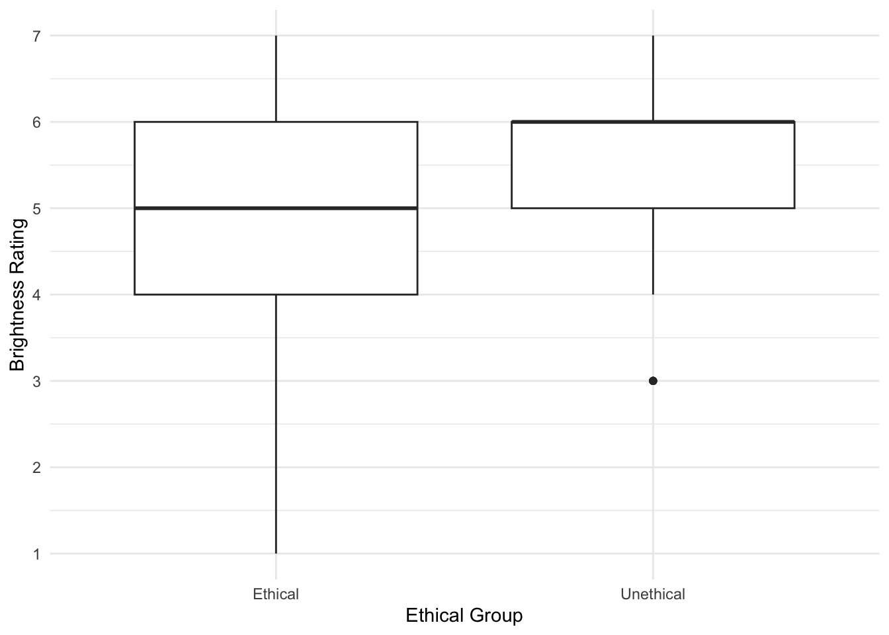

# Introduction to Generalised Linear Models

In this chapter, we build on simple and multiple linear regression. All the lessons you learnt there still apply for building models with one or more predictors, but sometimes it is not appropriate to assume normality. It is a popular and convenient choice as assuming normality is often robust, but for some outcomes it would simply not be the appropriate choice. Generalised linear models allow you to specify a link and link function for the model residuals, so you can apply a linear model to alternative distributions. In this chapter, we will cover two types of generalised linear models: logistic regression and ordinal regression. 

## Learning objectives

By the end of this chapter, you should be able to: 

1. Understand how to run and interpret [logistic regression](#logistic-regression).

2. Understand how to run and interpret [ordinal regression](#ordinal-regression).

To follow along to this chapter and try the code yourself, please download the data files we will be using in [this zip file](data/03_data.zip).

## Packages and the data sets

We first need to load some packages and the data for this task. If you do not have any of the packages, make sure you install them first.


```r
# wrangling and visualisation functions 
library(tidyverse)
# Parameter estimates
library(emmeans)
# Ordinal regression
library(ordinal)

# Irving data for logistic regression
irving_data <- read_csv("data/Irving_2021.csv") %>% 
  mutate(Condition = as.factor(Condition))

# Brandt data for ordinal regression
Brandt_data <- read_csv("data/Brandt_unlit.csv") %>% 
  mutate(ExpCond = as.factor(case_when(ExpCond == 1 ~ 0, # Ethical 
                             ExpCond == -1 ~ 1))) # Unethical
```

## Logistic Regression{#logistic-regression}

### Introduction to the dataset

For the guided examples, we have two datasets, but we will introduce them in turn. To demonstrate logistic regression, we will use data from the original @irving_correcting_2022 study, which Bartlett and Zhang from chapter 1's data replicated.

Irving et al. studied statistical misinformation, meaning a scientific result that people think is true, but later turns out to be false. Their specific focus was on mistaking correlational evidence for causal evidence and how you can best correct misinformation. Their research question was: Can you correct statistical misinformation through debunking? The hypothesis was: There will be fewer causal inferences in the correction group compared to the no correction group

129 participants completed a continuous influence paradigm where participants read a fictious newspaper article one sentence at a time about a causal link between cognitive decline and watching TV in older adults. There is one independent variable (`Condition`) to randomly allocate participants into one of two groups: 

1. The correction group (group `1` in the data) had one sentence saying: “The lead author has since specified that the results have been misrepresented and that TV screen time has not yet been found to cause cognitive decline. Only a correlation has been found…”

2. The no correction group (group `0` in the data) alternatively said: “The lead author of the study could not be reached for comment”

Participants then completed five free-text questions asking them about information in the study. Their responses were manually coded and received a 1 if they made a mistaken causal inference, or a 0 if they did not make one (`DV1_1` to `DV1_5` in the data set). 

In chapter 1, we looked at the sum of these inferences to approach the data analysis assuming normality, but here we will treat the questions individually. Instead of questioning whether people in the correction group would produce fewer mistaken causal inferences than those in the no correction group, we will test whether the probability of making a mistaken causal inference will be lower in the correction group compared to the no correction group.

For the guided example, we will focus on `DV1_1` which coded `1` or `0` for whether participant's provided a mistaken causal inference in the question "Based on the news story, why is binge watching TV seen as bad?".

### Exploratory data analysis

When starting any data analysis, it is important to visualise the data for some exploratory data analysis. Using the skills you developed in data skills for reproducible research, you can explore the data to understand its properties and look for potential patterns. In this scenario, a bar plot might be handy as we have a dichotomous outcome, so we can explore the frequency of responses across each group. 


```r
irving_data %>% 
  mutate(DV1_1 = factor(DV1_1)) %>% 
  ggplot(aes(x = DV1_1, fill = Condition)) + 
  geom_bar(position = "dodge") + 
  scale_x_discrete(name = "Mistaken Causal Inference in Question 1") + 
  scale_y_continuous(name = "Frequency", breaks = seq(0, 45, 5), limits = c(0,45)) + 
  theme_minimal()
```


It looks like more participants in the correction group compared to the no correction group did not make a mistaken causal inference (0), whereas more participants in the no correction group compared to the correction group made a mistaken causal inference (1).

Instead of counts, we can also express binary 0 and 1 data as a proportion or probability of making a mistake. If you take the mean of binary data, it tells you the proportion, so we can calculate the proportion of participant's making a mistake in each group. 


```r
irving_data %>% 
  group_by(Condition) %>% 
  summarise(proportion_causal_inference = mean(DV1_1))
```

<div class="kable-table">

|Condition | proportion_causal_inference|
|:---------|---------------------------:|
|0         |                   0.4696970|
|1         |                   0.3492063|

</div>

Both the bar plot and summary statistics support our prediction, participants in the no correction condition (47%) were more likely to make a mistaken causal inference than participants in the correction condition (35%). These are just descriptive statistics though, so you need to think about modelling to make inferences from these data. 

### Would linear regression work? 

::: {.warning data-latex=""}
The most important part of data analysis is your role as the decision maker and thinking about what would be the most appropriate choice of modelling. Sometimes, there are equally valid approaches, while other times there is one better suited approach. If you apply an inappropriate test, R will gladly follow your instructions. Its your job to think critically about your modelling approach and check its an appropriate choice. 
:::

When we have a dichotomous outcome coded 0 and 1, it has numerical value, so R will happily apply regular linear regression. 


```r
irving_model1 <- lm(DV1_1 ~ Condition, data = irving_data)

summary(irving_model1)
```

```
## 
## Call:
## lm(formula = DV1_1 ~ Condition, data = irving_data)
## 
## Residuals:
##     Min      1Q  Median      3Q     Max 
## -0.4697 -0.4697 -0.3492  0.5303  0.6508 
## 
## Coefficients:
##             Estimate Std. Error t value Pr(>|t|)    
## (Intercept)  0.46970    0.06058   7.754 2.51e-12 ***
## Condition1  -0.12049    0.08668  -1.390    0.167    
## ---
## Signif. codes:  0 '***' 0.001 '**' 0.01 '*' 0.05 '.' 0.1 ' ' 1
## 
## Residual standard error: 0.4921 on 127 degrees of freedom
## Multiple R-squared:  0.01499,	Adjusted R-squared:  0.007231 
## F-statistic: 1.932 on 1 and 127 DF,  p-value: 0.1669
```

It is somewhat interpretable as when you take the mean of binary data, you get the proportion. So, the intercept represents the proportion of mistaken causal inferences in the no correction group, and the slope coefficient represents the mean difference in proportion, suggesting there are .12/12% fewer mistakes in the correction group, but its not statistically significant. 

Although it works and we can make sense of the results, the question is whether it is an informative and appropriate way of modelling a binary outcome. Lets check the assumptions to see if anything looks off. 


```r
plot(irving_model1)
```


Now we can see the problems. Because we only have two possible outcomes, the assumption checks are all off. The qq plot in panel 2 particularly shows the problem, as there is a giant chunk missing where the values between 0 and 1 should at, at least theoretically if we assume normal residuals. 

Now we can apply logistic regression to more appropriately model the dichotomous nature of the outcome. 

### Logistic regression

#### Generalised linear regression

In a linear model, we model the outcome as a product of an intercept, a slope, and error. Its that final error part which is why we have worried about normality so far. In a regular linear regression model, we need the model residuals (the difference between the expected and observed values) to be normally distributed. 

Logistic regression is an adaptation of the linear regression framework we have worked with so far, where we can replace that error component. This is called generalised linear regression and we can specify a link and link function, instead of normal residuals being built into the model. 

So far, we have always used <code><span><span class='fu'><a target='_blank' href='https://rdrr.io/r/stats/lm.html'>lm</a></span><span class='op'>(</span><span class='op'>)</span></span></code>, but R comes with another function called <code><span><span class='fu'><a target='_blank' href='https://rdrr.io/r/stats/glm.html'>glm</a></span><span class='op'>(</span><span class='op'>)</span></span></code> for generalised linear regression models. To demonstrate how we can set the link family, we can use it to recreate a regular linear regression model, but this time explicitly calling a normal distribution as the link (using its alternate name a Gaussian distribution) and <code><span><span class='st'>"identity"</span></span></code> as the link function. 


```r
irving_model1_glm <- glm(DV1_1 ~ Condition, 
                     family = gaussian(link = "identity"), 
                     data = irving_data)

summary(irving_model1_glm)
```

```
## 
## Call:
## glm(formula = DV1_1 ~ Condition, family = gaussian(link = "identity"), 
##     data = irving_data)
## 
## Coefficients:
##             Estimate Std. Error t value Pr(>|t|)    
## (Intercept)  0.46970    0.06058   7.754 2.51e-12 ***
## Condition1  -0.12049    0.08668  -1.390    0.167    
## ---
## Signif. codes:  0 '***' 0.001 '**' 0.01 '*' 0.05 '.' 0.1 ' ' 1
## 
## (Dispersion parameter for gaussian family taken to be 0.24218)
## 
##     Null deviance: 31.225  on 128  degrees of freedom
## Residual deviance: 30.757  on 127  degrees of freedom
## AIC: 187.14
## 
## Number of Fisher Scoring iterations: 2
```

The link specifies the distribution family and the link function is the transformation for the model units. So, for our normal/Gaussian distribution, we have an identity link which essentially means no transformation, just the values we input. A normal distribution is described by a mean and standard deviation, so we just interpret the raw units in the model. 

The results here are accurate to the third decimal to show its an identical process. The only difference to our regular model output is the model fit statistics. Regular linear regression uses ordinal least squares to fit the model, whereas generalised linear regression fits the models using maximum likelihood. Holding everything else constant, this requires greater computing power, so its redundant to use <code><span><span class='fu'><a target='_blank' href='https://rdrr.io/r/stats/glm.html'>glm</a></span><span class='op'>(</span><span class='op'>)</span></span></code> when you just want to assume normal/Gaussian errors, but its important to show the logic behind these procedures. 

::: {.info data-latex=""}
In this chapter, we are focusing on logistic regression and ordinal regression as variations of generalised linear regression. There are more possibilities though, so type `?family` into the console to see the different families you could enter for the link and link function. 
:::

#### Logistic regression in `glm()`

After that brief detour, we will now actually fit the logistic regression model using <code><span><span class='fu'><a target='_blank' href='https://rdrr.io/r/stats/glm.html'>glm</a></span><span class='op'>(</span><span class='op'>)</span></span></code>. As we have a dichotomous outcome, one useful distribution is the binomial. This applies when you want to calculate the probability of an dichotomous outcome from a series of successes (1s) and failures (0s). This models that probability nicely as it has a boundary of 0 or 0% (no successes) and 1 or 100% (all successes). Traditionally, we refer to successes and failures, but you can apply it to any binary outcome where one response is labelled 0 and the other response is labelled 1. 

To apply the linear model element, we then use the <code><span><span class='st'>"logit"</span></span></code> link function as the unit transformation. Probability ranges between 0 and 1, odds range between 0 and infinity, but log odds (the logit bit) range between minus infinity and infinity, meaning we can fit straight lines to it. Let's see what a logistic regression model looks like. 


```r
irving_model2 <- glm(DV1_1 ~ Condition, 
                     family = binomial(link = "logit"), 
                     data = irving_data)

summary(irving_model2)

confint(irving_model2)
```

```
## Waiting for profiling to be done...
```

```
## 
## Call:
## glm(formula = DV1_1 ~ Condition, family = binomial(link = "logit"), 
##     data = irving_data)
## 
## Coefficients:
##             Estimate Std. Error z value Pr(>|z|)
## (Intercept)  -0.1214     0.2466  -0.492    0.623
## Condition1   -0.5012     0.3615  -1.386    0.166
## 
## (Dispersion parameter for binomial family taken to be 1)
## 
##     Null deviance: 174.71  on 128  degrees of freedom
## Residual deviance: 172.77  on 127  degrees of freedom
## AIC: 176.77
## 
## Number of Fisher Scoring iterations: 4
## 
##                  2.5 %    97.5 %
## (Intercept) -0.6095075 0.3620304
## Condition1  -1.2179406 0.2032817
```

The model looks reassuringly similar. We have our coefficients for the intercept and slope, with their standard errors and *p*-values. There are no *p*-values for the model fit though as remember they are based on maximum likelihood, rather than least squares. 

The main difference here is the interpretation of the coefficients. The link function is logit, so we get them in log odds. These are not intuitive to interpret, so we can take the exponential to interpret the slope coefficient as an odds ratio with its 95% CI. 


```r
# Take the exponential of the second coefficient to avoid typing it manually
exp(coef(irving_model2)[2])

# Exponential of the confidence interval
exp(confint(irving_model2))
```

```
## Waiting for profiling to be done...
```

```
## Condition1 
##  0.6058222 
##                 2.5 %   97.5 %
## (Intercept) 0.5436185 1.436243
## Condition1  0.2958388 1.225418
```

An odds ratio is a ratio of the odds of an event happening in one group compared to the odds of an event happening in another group. In this context, a ratio of making a mistaken causal inference (1s compared to 0s) in the no correction group, compared to the correction group. 

An odds ratio of 1 means they are equally likely to happen. An odds ratio of less than 1 means something is less likely to happen, whereas more than 1 means something is more likely to happen. The odds ratio is 0.61 here, suggesting the odds of making a mistaken causal inference is lower in the correction group (our target group - `1`) compared to the no correction group (the reference group - `0`). Odds ratios below 1 can be tricky to interpret, so you can flip them around by taking the reciprocal. 


```r
# Take the reciprocal of the exponential of the second coefficient 
1 / exp(coef(irving_model2)[2])

# Reciprocal of the exponential of the confidence interval
1 / exp(confint(irving_model2))
```

```
## Waiting for profiling to be done...
```

```
## Condition1 
##   1.650649 
##                2.5 %    97.5 %
## (Intercept) 1.839525 0.6962612
## Condition1  3.380219 0.8160484
```

Expressed this way, there are 1.65 [0.82, 3.38] lower odds (or expressed in probability 65% lower) of making a mistaken causal inference in the correction group compared to the no correction group. In this model, it is not statistically significant and we can see there is a decent amount of uncertainty around the estimate, with an odds ratio spanning above and below 1. 

::: {.warning data-latex=""}
In this scenario, you would get the same reciprocal odds ratio if you changed the groups around with correction as the reference group. Taking the reciprocal is the same information expressed differently, but its important you are clear about the model estimates to avoid confusing your reader. If you do this yourself, make sure you explain what the model estimates were and how you took the reciprocal. 
:::

Returning to the idea of model comparison, we could compare the two GLM models using <code><span><span class='fu'><a target='_blank' href='https://rdrr.io/r/stats/anova.html'>anova</a></span><span class='op'>(</span><span class='op'>)</span></span></code> and it will tell you the change in deviance (relating the maximum likelihood fitting process), but we can focus on comparing the AIC values for model fit between the two models. Lower values of AIC are better and if we subtract model 1 (the linear model) from model 2 (the logistic model), a negative difference would indicate better model fit from the ordinal model. 


```r
AIC(irving_model2) - AIC(irving_model1_glm)
```

```
## [1] -10.36985
```

Reassuringly, the logistic regression model fits the data better with less prediction error when we use a binomial distribution for the errors, compared to when we force it into a normal residual model.

#### Calculating the model probability estimates

Finally, there is a relationship between probability, odds, and log odds. So, we can use the coefficients to produce model estimates for the probability of a mistaken causal inference in each group. The logic is the same as for regular linear regression models, the intercept is the reference group, and the slope coefficient for your predictor is the shift across units of your predictors. We can calculate the probability by taking the exponential of the log odds divided by 1 plus the exponential log odds. 


```r
# Estimated probability of making an error in the 0 condition 
# We use coef() to isolate the model coefficients and subset the 1st item - the intercept
exp(coef(irving_model2)[1]) / (1 + exp(coef(irving_model2)[1]))
```

```
## (Intercept) 
##    0.469697
```

This means the estimated probability of a mistaken causal inference in the no correction condition is .47 or 47%. Then for the correction group, we repeat the process, but adding together the intercept and slope coefficient. Given the slope was negative, this is the equivalent of subtracting the slope. 


```r
# Estimated probability of making an error in the 1 condition
# We use coef() to isolate the model coefficients and subset the 1st item - the intercept 
# We then add the 2nd item in coef() - the slope 
exp(coef(irving_model2)[1] + coef(irving_model2)[2]) / (1 + exp(coef(irving_model2)[1] + coef(irving_model2)[2]))
```

```
## (Intercept) 
##   0.3492063
```

This means the estimated probability of a mistaken causal inference in the correction condition is .35 or 35%. These values line up nicely with our original summary statistics, but keep in mind they are model estimates. They are closer here as its a very simple model and we are demonstrating the principles, but they will not line up this close when you have more complex models with partial effects to understand. 

#### Using `emmeans` to get model estimates

Another way of getting model estimates is using <code><span><span class='fu'>emmeans</span><span class='op'>(</span><span class='op'>)</span></span></code> function from the <code class='package'>emmeans</code> package [@Lenth2022]. This can be particularly useful in more complicated models when you want marginal effects across interactions, but you might prefer to see the estimates in this format instead of reconstructing them from the coefficients. 


```r
# logistic regression model as the object
# Specifying Condition as the predictor we want marginal effects for
emmeans(irving_model2, specs = "Condition")
```

```
##  Condition emmean    SE  df asymp.LCL asymp.UCL
##  0         -0.121 0.247 Inf    -0.605     0.362
##  1         -0.623 0.264 Inf    -1.141    -0.105
## 
## Results are given on the logit (not the response) scale. 
## Confidence level used: 0.95
```

These are still in log odds units, so you can calculate the probability using the same $exp(logit) / 1 + exp(logit)$ method. For example, the estimated probability of a mistaken causal conclusion in the no correction group (`0`) is:


```r
exp(-0.121) / (1 + exp(-0.121))
```

```
## [1] 0.4697869
```

Which corresponds nicely with what we reconstructed from the model coefficients. 

## Ordinal Regression{#ordinal-regression}

### Introduction to the dataset

To demonstrate ordinal regression, we will use data from @brandt_does_2014. The aim of Brandt et al. was to replicate a relatively famous social psychology study (Banerjee et al., 2012) on the effect of recalling unethical behaviour on the perception of brightness.

In common language, unethical behaviour is considered as "dark", so the original authors designed a priming experiment where participants were randomly allocated to recall an unethical behaviour or an ethical behaviour from their past. Participants then completed a series of measures including their perception of how bright the testing room was. Brandt et al. were sceptical and wanted to replicate this study to see if they could find similar results.

Participants were randomly allocated (`ExpCond`) to recall an unethical behaviour (`1`; n = 49) or an ethical behaviour (`0`; n = 51). The key outcome was their perception of how bright the room was (`welllit`), from 1 (not bright at all) to 7 (very bright). The research question was: Does recalling unethical behaviour lead people to perceive a room as darker than if they recall ethical behaviour?

### Exploratory data analysis

When starting any data analysis, it is important to visualise the data for some exploratory data analysis. Using the skills you developed in data skills for reproducible research, you can explore the data to understand its properties and look for potential patterns. We can create a boxplot to get a brief overview of how perceived brightness changes depending on the experimental condition. 


```r
Brandt_data %>% 
  ggplot(aes(x = ExpCond, y = welllit)) + 
  geom_boxplot() + 
  scale_x_discrete(name = "Ethical Group", labels = c("Ethical", "Unethical")) + 
  scale_y_continuous(name = "Brightness Rating", breaks = 1:7) + 
  theme_minimal()
```



There are some signs of the outcome being ordinal, but its not super obvious. We can create a histogram showing the distribution of brightness rating by group, to see how discrete the data are. 


```r
Brandt_data %>% 
  ggplot(aes(x = welllit, fill = ExpCond)) + 
  geom_histogram(position = "dodge") + 
  scale_x_continuous(name = "Brightness Rating", breaks = 1:7) + 
  scale_y_continuous(name = "Count", breaks = seq(0, 20, 5), limits = c(0, 20)) + 
  theme_minimal()
```


That's much better. Now, we can see the clearly ordinal nature of brightness rating and how participants can only respond on the integer 1-7 scale. 

### Would linear regression work? 

::: {.warning data-latex=""}
The most important part of data analysis is your role as the decision maker and thinking about what would be the most appropriate choice of modelling. Sometimes, there are equally valid approaches, while other times there is one better suited approach. If you apply an inappropriate test, R will gladly follow your instructions. Its your job to think critically about your modelling approach and check its an appropriate choice. 
:::

R will happily let us apply simple linear regression to predict brightness rating (`welllit`) from the categorical predictor of experimental condition (`ExpCond`). This is by far the most common approach to tackling ordinal outcomes in psychology, particularly when you take the mean or sum of multiple ordinal items, so it looks a little more continuous. If you meet the other assumptions of linear regression, it can often be a pragmatic and robust approach. 


```r
# Linear model predicting brightness rating from condition 
brandt_model1 <- lm(welllit ~ ExpCond, data = Brandt_data)

# model summary
summary(brandt_model1)

# Confidence intervals around estimates
confint(brandt_model1)
```

```
## 
## Call:
## lm(formula = welllit ~ ExpCond, data = Brandt_data)
## 
## Residuals:
##     Min      1Q  Median      3Q     Max 
## -4.1569 -0.3673  0.2379  0.8431  1.8431 
## 
## Coefficients:
##             Estimate Std. Error t value Pr(>|t|)    
## (Intercept)   5.1569     0.1779  28.992   <2e-16 ***
## ExpCond1      0.2105     0.2541   0.828    0.409    
## ---
## Signif. codes:  0 '***' 0.001 '**' 0.01 '*' 0.05 '.' 0.1 ' ' 1
## 
## Residual standard error: 1.27 on 98 degrees of freedom
## Multiple R-squared:  0.006953,	Adjusted R-squared:  -0.00318 
## F-statistic: 0.6861 on 1 and 98 DF,  p-value: 0.4095
## 
##                  2.5 %    97.5 %
## (Intercept)  4.8038772 5.5098483
## ExpCond1    -0.2937809 0.7147492
```

The intercept suggests the mean brightness rating for participants in the ethical group was 5.16. The coefficient and model are not statistically significant - explaining very little variance in the outcome - and suggests those in the unethical group had a mean increase in brightness rating of 0.21 [-0.29, 0.71]. 

The first problem comes in the interpretation. As a linear model expecting normally distributed residuals, we get means for the intercept and coefficient, and they could - at least theoretically - be any values. So, we get an average of 5.16 and 5.37 for our two groups, but the scale items could only be integers from 1-7. So, you can question how informative it is to treat these data as interval, when they are only labels for arbitrary numbers ranging from 1 (not bright at all) to 7 (very bright). 

The second problem comes in the assumptions of the model. If the means are around the middle of the scale, it can behave approximately normal. If the means are closer to the boundaries, then you start running into problems as the residuals that the model thinks are theoretically boundless, hit a boundary. Let's look at the checks for this model. 


```r
plot(brandt_model1)
```


The qq plot in pane 2 of the residuals against the theoretical distribution is key here. Most of the points follow the dashes line, but it shifts away towards the lower boundary. There are also telltale signs of discrete ordinal data as the residuals move in set points. This is because the outcome can only be 1-7, but the theoretical quantiles are boundless. 

So, while the assumptions do not look catastrophic, we will explore how we can model the ordinal nature of the outcome better. 

### Ordinal regression

Ordinal regression models are a kind of logistic regression model. They are also known as cumulative link or ordered logit models. They work on the same logic as logistic regression where we want to model the probability of a discrete outcome, but instead of only two possible outcomes, ordinal regression models split a scale up into an ordered series of discrete outcomes. Between each scale point, the model estimates the threshold and sees how the outcome shifts across your predictor(s). 

To get an idea of cumulative probability, we can plot the Brandt et al. data to see how the cumulative percentage of responses across the scale shifts for each group. 


```r
Brandt_data %>% 
  ggplot(aes(x = welllit, colour = ExpCond)) + 
  stat_ecdf() +
  scale_x_continuous(breaks = 1:7, name = "Brightness Perception") + 
  scale_y_continuous(breaks = seq(0, 1, 0.2), name = "Cumulative Percent") + 
  theme_minimal()
```


For each group, the lines corresponds with the cumulative percentage at each scale point. When the line is horizontal, there is no change. When the line moves vertically, it represents the next percentage increase, adding to the cumulative percentage from the previous shift, until you reach 100%. 

Ordinal regression models estimate these shifts in probability and you get *k*-1 estimates for the thresholds, meaning you get one fewer estimate than the total number of scale points. Behind the scenes, the model interprets the outcome as a Gaussian looking latent variable, meaning the ordinal scale points are tapping into some kind of construct, but honouring there are discrete scale points. 

The coefficient in the model represents the probability shift of a 1 scale point increase from one distribution to another on the scale of your predictors. So, for every 1-unit increase in a continuous predictor, you see how the probability shifts, or how the probability shifts for the difference between two groups in a categorical predictor. A positive slope coefficient would mean an increase in probability along your predictor scale, while a negative slope coefficient would mean a decrease in probability along your predictor scale. 

We will fit ordinal regression models using the <code class='package'>ordinal</code> [@Christensen2023] package as it nicely supports cumulative link models as regular regression models we have used until this point or scaled up to mixed effects models. 

First, we need to convert the outcome into a factor, so there are a discrete ordered number of points.


```r
Brandt_data <- Brandt_data %>% 
  mutate(WellLitFactor = factor(welllit))

levels(Brandt_data$WellLitFactor)
```

```
## [1] "1" "3" "4" "5" "6" "7"
```

We can see here the scale points are in ascending order as we want them to be, and no one in the data ever responded 2. Next, we can fit our ordinal regression model using the same format as all our regression models. 


```r
# clm = cumulative link model
brandt_model2 <- clm(WellLitFactor ~ ExpCond, data = Brandt_data)

summary(brandt_model2)

confint(brandt_model2)
```

```
## formula: WellLitFactor ~ ExpCond
## data:    Brandt_data
## 
##  link  threshold nobs logLik  AIC    niter max.grad cond.H 
##  logit flexible  100  -152.47 316.94 6(0)  1.10e-07 6.9e+01
## 
## Coefficients:
##          Estimate Std. Error z value Pr(>|z|)
## ExpCond1   0.2594     0.3606   0.719    0.472
## 
## Threshold coefficients:
##     Estimate Std. Error z value
## 1|3  -4.4751     1.0181  -4.395
## 3|4  -1.7798     0.3403  -5.231
## 4|5  -1.0845     0.2921  -3.713
## 5|6   0.1309     0.2703   0.484
## 6|7   1.9504     0.3460   5.637
##               2.5 %    97.5 %
## ExpCond1 -0.4465061 0.9702407
```

In the first segment of the output, its somewhat similar to the other models we have fitted, but there is no intercept at the top. We just have the slope coefficients for each predictor (1 in this case), then the threshold coefficients for *k*-1 scale points. 

As this is an adapted version of logistic regression, the units are in log odds. So, they are easier to interpret as an odds ratio by taking the exponential. 


```r
exp(brandt_model2$beta)

exp(confint(brandt_model2))
```

```
## ExpCond1 
## 1.296112 
##              2.5 %  97.5 %
## ExpCond1 0.6398599 2.63858
```

The results correspond with what we plotted previously, we have an odds ratio of 1.30 [0.64, 2.64], meaning there are 1.3 higher odds of a brighter rating in the unethical condition compared to the ethical condition. However, the confidence interval is pretty wide here and the *p*-value is not statistically significant, so we cannot conclude there is a shift in probability between the two groups here.

Returning to the idea of model comparison, it will not let us compare them using <code><span><span class='fu'><a target='_blank' href='https://rdrr.io/r/stats/anova.html'>anova</a></span><span class='op'>(</span><span class='op'>)</span></span></code> as we cannot compare the same outcome when its numeric vs a factor. However, we can compare the AIC values for model fit between the two models. Lower values of AIC are better and if we subtract model 1 (the linear model) from model 2 (the ordinal model), a negative difference would indicate better model fit from the ordinal model. 


```r
AIC(brandt_model2) - AIC(brandt_model1)
```

```
## [1] -18.67021
```

That does seem to be the case here. Although both models were non-significant, modelling the outcome as ordinal - reassuringly - fits the data better with less prediction error. 

#### Breaking down threshold coefficients

We would normally focus on the coefficient as the main outcome of the modelling, but we can also break down the threshold coefficients so they are not a mystery. These represent the estimates for the cumulative probability of choosing a given scale point. These relate to the reference group, so we see the cumulative probability of the ethical condition. Remember, these are still in log odds, so we can calculate the probability like we did for logistic regression by dividing the odds ratio by 1 plus the odds ratio. 

::: {.info data-latex=""}
The code below uses <code><span><span class='fu'><a target='_blank' href='https://rdrr.io/r/stats/coef.html'>coef</a></span><span class='op'>(</span><span class='op'>)</span></span></code> function and subsetting (the `[1]`etc.) to avoid writing out the numbers manually and reduce copy and paste errors. Try `coef(brandt_model2)` in the console to see the coefficients it returns.  
:::


```r
# Cumulative percentage for ethical group choosing less than 3 - coefficient 1
exp(coef(brandt_model2)[1]) / (1 + exp(coef(brandt_model2)[1]))

# Cumulative percentage for ethical group choosing less than 4 - coefficient 2
exp(coef(brandt_model2)[2]) / (1 + exp(coef(brandt_model2)[2]))

# Cumulative percentage for ethical group choosing less than 5- coefficient 3
exp(coef(brandt_model2)[3]) / (1 + exp(coef(brandt_model2)[3]))

# Cumulative percentage for ethical group choosing less than 6- coefficient 4
exp(coef(brandt_model2)[4]) / (1 + exp(coef(brandt_model2)[4]))

# Cumulative percentage for ethical group choosing less than 7- coefficient 5
exp(coef(brandt_model2)[5]) / (1 + exp(coef(brandt_model2)[5]))
```

```
##        1|3 
## 0.01126058 
##       3|4 
## 0.1443283 
##       4|5 
## 0.2526636 
##       5|6 
## 0.5326661 
##       6|7 
## 0.8754855
```

This means choosing less than 3 (remember no one responded 2) represents .011 or 1.12%. Choosing less than 4 represents .144 or 14.4%, and so on. Once we get to the final threshold, this represents less than 7 at .875/87.5%. The cumulative probability of 7 or less is then 1/100%, which is why you get *k*-1 thresholds. So, you can work that final step out as 1 - .875 = .125/12.5%. 

These cumulative percentage estimates are for the reference group (ethical), so you could calculate the estimate for the unethical group by subtracting the slope coefficient (0.2594) from each threshold. For example, for the first threshold: 


```r
# Cumulative percentage for unethical group choosing less than 3
# Coefficient 1 minus coefficient 6 as the slope is weirdly the last one here, not the first
exp(coef(brandt_model2)[1] - coef(brandt_model2)[6]) / (1 + exp(coef(brandt_model2)[1] - coef(brandt_model2)[6]))
```

```
##         1|3 
## 0.008710377
```

::: {.info data-latex=""}
As before, we are using the <code><span><span class='fu'><a target='_blank' href='https://rdrr.io/r/stats/coef.html'>coef</a></span><span class='op'>(</span><span class='op'>)</span></span></code> function and subsetting (the `[1]`etc.) to avoid writing out the numbers manually and reduce copy and paste errors. This time, we are using two coefficients to subtract the slope coefficient from each threshold coefficient. So, if you apply this to a new data set, make sure you check how many coefficients there are to subset them accurately. 
:::

This means the cumulative probability estimate for less than 3 is .009 or 0.87% in the unethical group. 

#### Different threshold assumptions

Finally, the default option in <code class='package'>ordinal</code> is for `flexible` thresholds between scale points. This estimates a coefficient for threshold and makes the fewest assumptions about the outcome. Alternative options are `equidistant` which assume evenly spaced scale points, or `symmetric` which assume scale points are evenly spaced above and below the scale center. These two make stronger assumptions about the outcome but require fewer parameters, so you would need to think carefully about whether they would suit the outcome you are modelling. 

To see how the `equidistant` option would compare: 


```r
# clm = cumulative link model with equidistant thresholds
brandt_model3 <- clm(WellLitFactor ~ ExpCond, data = Brandt_data, threshold = "equidistant")

summary(brandt_model3)
```

```
## formula: WellLitFactor ~ ExpCond
## data:    Brandt_data
## 
##  link  threshold   nobs logLik  AIC    niter max.grad cond.H 
##  logit equidistant 100  -158.95 323.90 5(0)  7.75e-11 8.3e+01
## 
## Coefficients:
##          Estimate Std. Error z value Pr(>|z|)
## ExpCond1   0.2728     0.3583   0.761    0.447
## 
## Threshold coefficients:
##             Estimate Std. Error z value
## threshold.1  -3.7721     0.4394  -8.585
## spacing       1.3626     0.1280  10.647
```

This time, you only get one threshold estimate and a spacing parameter. Instead of calculating the cumulative probability at each threshold, you must successively add them together:


```r
# Cumulative percentage for ethical group choosing less than 3 equally spaced
exp(coef(brandt_model3)[1] + 0 * coef(brandt_model3)[2]) / (1 + exp(coef(brandt_model3)[1] + 0 * coef(brandt_model3)[2]))

# Cumulative percentage for ethical group choosing less than 4 equally spaced
exp(coef(brandt_model3)[1] + 1 * coef(brandt_model3)[2]) / (1 + exp(coef(brandt_model3)[1] + 1 * coef(brandt_model3)[2]))

# Etc. 
```

```
## threshold.1 
##  0.02248644 
## threshold.1 
##  0.08245417
```

## Independent activities

Now you have followed along to the guided examples, it is important you can transfer your knowledge to a new scenario. So, we have two new exercises for you to try out your understanding of these techniques on. Follow the instructions below and answer the questions, you can then scroll down to the [end of the chapter](#C3_solution) to see the solution we based on the questions on. 

### Independent logistic regression

For an independent activity, we will use the same data set from @irving_correcting_2022, but this time using a different question as a binary outcome. If you are coming to this fresh, make sure to remind yourself of the data set outlined in the [logistic regression section](#logistic-regression) and load the data. 

Instead of using `DV1_1`, you will use `DV1_3` instead. This asked participants "Based on the results of this study, can we conclude that watching TV causes cognitive decline?". Coded responses were 1 for if the participant's responded with a mistaken causal conclusion and 0 if they did not provide a mistaken causal conclusion. 

::: {.try data-latex=""}
From here, apply what you learnt in the guided example for logistic regression to this new independent task and complete the questions below to check your understanding. Remember you are predicting `DV1_3` from `Condition` to see if the probability of a mistaken causal inference is greater in the correction condition compared to the no correction condition. 
:::

- The correction condition is a <select class='webex-select'><option value='blank'></option><option value='answer'>significant</option><option value='x'>non-significant</option></select> and <select class='webex-select'><option value='blank'></option><option value='x'>positive</option><option value='answer'>negative</option></select> predictor of the third mistaken causal inference question.  

- Rounding to two decimals, the slope coefficient converted to an odds ratio is <input class='webex-solveme nospaces' data-tol='0.001' size='4' data-answer='["0.09",".09"]'/>. Taking the reciprocal, the odds ratio is <input class='webex-solveme nospaces' data-tol='0.001' size='5' data-answer='["10.58"]'/> [lower 95% CI = <input class='webex-solveme nospaces' data-tol='0.001' size='4' data-answer='["2.85"]'/>, upper 95% CI = <input class='webex-solveme nospaces' data-tol='0.001' size='4' data-answer='["68.8"]'/>].

- This suggests there are <input class='webex-solveme nospaces' data-tol='0.001' size='5' data-answer='["10.58"]'/> lower odds of making a mistaken causal inference in the <select class='webex-select'><option value='blank'></option><option value='x'>no correction</option><option value='answer'>correction</option></select> condition compared to the <select class='webex-select'><option value='blank'></option><option value='answer'>no correction</option><option value='x'>correction</option></select> condition. 

- Rounding to three decimals, the estimated probability of making a mistaken causal inference in the no correction group is <input class='webex-solveme nospaces' data-tol='0.001' size='5' data-answer='["0.258",".258"]'/> and the estimated probability of making a mistaken causal inference in the correction group is <input class='webex-solveme nospaces' data-tol='0.001' size='5' data-answer='["0.032",".032"]'/>. 

### Independent ordinal regression

For an independent activity, we will use data from @schroeder_sound_2015. The aim of the study was to investigate whether delivering a short speech to a potential employer would be more effective at landing you a job than writing the speech down and the employer reading it themselves. Thirty-nine professional recruiters were randomly assigned to receive a job application speech as either a transcript for them to read, or an audio recording of the applicant reading the speech.

The recruiters then rated the applicants on perceived intellect, their impression of the applicant, and whether they would recommend hiring the candidate. All ratings were originally on a rating scale ranging from 0 (low intellect, impression etc.) to 10 (high impression, recommendation etc.), with the final value representing the mean across several items.

For this example, we will focus on the hire rating (variable `Hire_Rating` to see whether the audio condition had a would lead to higher ratings than the transcript condition (variable `CONDITION`).


```r
schroeder_data <- read_csv("data/Schroeder_hiring.csv") %>% 
  mutate(condition = as.factor(CONDITION))
```

::: {.try data-latex=""}
From here, apply what you learnt in the guided example for ordinal regression to this new independent task and complete the questions below to check your understanding. Remember you will need to treat the outcome as a factor to fit the ordinal model. The answers are based on the default approach for estimating flexible thresholds.
:::

- The experimental condition is a <select class='webex-select'><option value='blank'></option><option value='answer'>significant</option><option value='x'>non-significant</option></select> and <select class='webex-select'><option value='blank'></option><option value='answer'>positive</option><option value='x'>negative</option></select> predictor of hire rating.  

- Rounding to two decimals, the slope coefficient converted to an odds ratio is <input class='webex-solveme nospaces' data-tol='0.001' size='4' data-answer='["4.67"]'/> [lower 95% CI = <input class='webex-solveme nospaces' data-tol='0.001' size='4' data-answer='["1.44"]'/>, upper 95% CI = <input class='webex-solveme nospaces' data-tol='0.001' size='5' data-answer='["16.31"]'/>].

- This suggests there are <input class='webex-solveme nospaces' data-tol='0.001' size='4' data-answer='["4.67"]'/> higher odds of a larger hire rating in the <select class='webex-select'><option value='blank'></option><option value='x'>transcript</option><option value='answer'>audio</option></select> condition compared to the <select class='webex-select'><option value='blank'></option><option value='answer'>transcript</option><option value='x'>audio</option></select> condition. 

- Rounding to three decimals, the estimated cumulative probability for the transcript group choosing a hire rating of lower than 3 (hint: coefficient 3) is <input class='webex-solveme nospaces' data-tol='0.001' size='5' data-answer='["0.498",".498"]'/> and the cumulative probability for the audio group  choosing a hire rating of lower than 3 (hint: coefficient 3 minus coefficient 9) is <input class='webex-solveme nospaces' data-tol='0.001' size='5' data-answer='["0.175",".175"]'/>. 

## Further resources

1. <a href="https://openintro-ims.netlify.app/model-logistic" target="_blank">The online textbook Introduction to Modern Statistics</a> by Çetinkaya-Rundel and Hardin (2021) outlines logistic regression in chapter 9, then separatly covers the inferential element in chapter 26. 

2. <a href="https://cran.r-project.org/web/packages/ordinal/vignettes/clm_article.pdf" target="_blank">The ordinal package vignette</a> by Christensen (2023) outlines ordinal regression and the models you can fit using the package in lots of detail. 

## Independent activity solutions{#C3_solution}

### Independent logistic regression

To produce a logistic regression model for the third causal question, we will predict `DV1_3` from `Condition` as a single predictor. 


```r
irving_model3 <- glm(DV1_3 ~ Condition, 
                     family = binomial(link = "logit"), 
                     data = irving_data)

summary(irving_model3)
```

```
## 
## Call:
## glm(formula = DV1_3 ~ Condition, family = binomial(link = "logit"), 
##     data = irving_data)
## 
## Coefficients:
##             Estimate Std. Error z value Pr(>|z|)    
## (Intercept)  -1.0586     0.2815  -3.761 0.000169 ***
## Condition1   -2.3591     0.7718  -3.057 0.002237 ** 
## ---
## Signif. codes:  0 '***' 0.001 '**' 0.01 '*' 0.05 '.' 0.1 ' ' 1
## 
## (Dispersion parameter for binomial family taken to be 1)
## 
##     Null deviance: 107.837  on 128  degrees of freedom
## Residual deviance:  93.043  on 127  degrees of freedom
## AIC: 97.043
## 
## Number of Fisher Scoring iterations: 6
```

We can calculate the odds ratio from the coefficients in log odds by taking the exponential for the slope and its 95% CI. 


```r
# Odds ratio from log odds of making an error in condition 1 compared to 0
exp(coef(irving_model3)[2])

# Confidence interval on odds ratio
exp(confint(irving_model3))
```

```
## Waiting for profiling to be done...
```

```
## Condition1 
## 0.09450338 
##                  2.5 %    97.5 %
## (Intercept) 0.19420051 0.5898304
## Condition1  0.01453579 0.3508368
```

When the odds ratio is below 1, it can be easier to interpret by taking the reciprocal and flip the comparison around. 


```r
# Reciprocal of odds ratio from log odds of making an error in condition 1 compared to 0
1 / exp(coef(irving_model3)[2])

# Reciprocal of confidence interval on odds ratio
1 / exp(confint(irving_model3))
```

```
## Waiting for profiling to be done...
```

```
## Condition1 
##   10.58163 
##                 2.5 %   97.5 %
## (Intercept)  5.149317 1.695403
## Condition1  68.795718 2.850328
```

You can calculate the probabilities for each group by using the intercept in the probability equation, then the intercept plus the slope coefficient. 


```r
# Estimated probability of making an error in the 0 condition 
exp(coef(irving_model3)[1]) / (1 + exp(coef(irving_model3)[1]))

# Estimated probability of making an error in the 1 condition 
exp(coef(irving_model3)[1] + coef(irving_model3)[2]) / (1 + exp(coef(irving_model3)[1] + coef(irving_model3)[2]))
```

```
## (Intercept) 
##   0.2575758 
## (Intercept) 
##  0.03174603
```

Alternatively, you could use <code><span><span class='fu'>emmeans</span><span class='op'>(</span><span class='op'>)</span></span></code> to get the model estimates and use the logit estimates to calculate the probabilities.  


```r
emmeans(irving_model3, "Condition")
```

```
##  Condition emmean    SE  df asymp.LCL asymp.UCL
##  0          -1.06 0.281 Inf     -1.61    -0.507
##  1          -3.42 0.719 Inf     -4.83    -2.009
## 
## Results are given on the logit (not the response) scale. 
## Confidence level used: 0.95
```


```r
exp(-1.06) / (1 + exp(-1.06))

exp(-3.42) / (1 + exp(-3.42))
```

```
## [1] 0.2573095
## [1] 0.03167623
```

### Independent ordinal regression

First, we need to convert hire rating to a factor for the ordinal model to work. 


```r
schroeder_data <- schroeder_data %>% 
  mutate(hire_factor = factor(Hire_Rating))
```

We can explore the distribution of the two groups and see there is a clearer difference here, with more low ratings in the transcript (`0`) group and more high ratings in the audio (`1`) group. 


```r
schroeder_data %>% 
  ggplot(aes(x = Hire_Rating, fill = condition)) + 
  geom_histogram(position = "dodge") + 
  scale_x_continuous(breaks = 0:8, name = "Hire Rating") +
  theme_minimal()
```


Alternatively, we can visualise the cumulative probability and see how it climbs steeper for the transcript group (more lower responses) and shallow for the audio group (more higher responses). 


```r
schroeder_data %>% 
  ggplot(aes(x = Hire_Rating, colour = condition)) + 
  stat_ecdf() +
  scale_x_continuous(breaks = 0:8, name = "Hire Rating") + 
  scale_y_continuous(breaks = seq(0, 1, 0.2), name = "Cumulative Percent") + 
  theme_minimal()
```


Finally, we can fit our ordinal regression model and see the slope coefficient is positive and it is statistically significant. 


```r
schroeder_model2 <- clm(hire_factor ~ condition, data = schroeder_data)

summary(schroeder_model2)

confint(schroeder_model2)
```

```
## formula: hire_factor ~ condition
## data:    schroeder_data
## 
##  link  threshold nobs logLik AIC    niter max.grad cond.H 
##  logit flexible  39   -77.29 172.59 7(1)  5.69e-10 1.6e+02
## 
## Coefficients:
##            Estimate Std. Error z value Pr(>|z|)  
## condition1   1.5409     0.6146   2.507   0.0122 *
## ---
## Signif. codes:  0 '***' 0.001 '**' 0.01 '*' 0.05 '.' 0.1 ' ' 1
## 
## Threshold coefficients:
##      Estimate Std. Error z value
## 0|1 -2.364790   0.754794  -3.133
## 1|2 -0.761366   0.459091  -1.658
## 2|3 -0.009953   0.437700  -0.023
## 3|4  0.526688   0.459758   1.146
## 4|5  1.262387   0.504261   2.503
## 5|6  2.197283   0.575101   3.821
## 6|7  2.357000   0.589496   3.998
## 7|8  3.976969   0.861277   4.618
##                2.5 %   97.5 %
## condition1 0.3669235 2.791582
```

To be easier to interpret, we can convert the log odds to the odds ratio by taking the exponential for the slope coefficient and its 95% confidence interval. 


```r
# Get beta as odds ratio instead of logit
exp(schroeder_model2$beta)

# Convert CI to odds ratio
exp(confint(schroeder_model2))
```

```
## condition1 
##   4.668953 
##               2.5 %  97.5 %
## condition1 1.443288 16.3068
```

Finally, as a demonstration, we can calculate the estimated cumulative probability of choosing a rating of less than 3 (0-2) for the transcript group and the audio group. Note we are using coefficient 3 as that is the third threshold. We then subtract coefficient 9 as the slope coefficient is added on to the end. 


```r
# Cumulative percentage for transcript group choosing less than 3 - coefficient 1
exp(coef(schroeder_model2)[3]) / (1 + exp(coef(schroeder_model2)[3]))

# Cumulative percentage for audio group choosing less than 3 - coefficient 1 minus coefficient 9
exp(coef(schroeder_model2)[3] - coef(schroeder_model2)[9]) / (1 + exp(coef(schroeder_model2)[3] - coef(schroeder_model2)[9]))
```

```
##       2|3 
## 0.4975119 
##       2|3 
## 0.1749581
```

