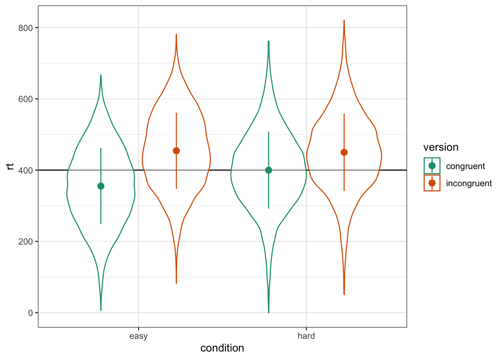

# Introduction to Linear Mixed Effects Models

In this chapter, we will explore linear mixed effects models by simulating data. Experimental designs that sample both subjects and stimuli from a larger population need to account for random effects of both subjects and stimuli using mixed-effects models. However, much of this research is analyzed using analysis of variance on aggregated responses because researchers are not confident specifying and interpreting mixed-effects models. This chapter will explain how to simulate data with random-effects structure (using the faux R package) and analyze the data using linear mixed-effects regression (with the lme4 R package), with a focus on interpreting the output in light of the simulated parameters. You will also learn to calculate power using simulation.

## Learning objectives

By the end of this chapter, you should be able to: 

1. Understand how data are structured for a linear mixed effects model

2. Be able to simulate data with a cross-classified structure

3. Understand how to run and interpret a linear mixed effects model

4. Run a power calculation for LMEM

To follow along to this chapter and try the code yourself, please download the Rmd file we will be using in [this zip file](data/11_data.zip).

## Packages and the data sets

We will simulate data using the faux package.


```r
library(tidyverse)   # for data wrangling, pipes, and good dataviz
library(afex)        # for mixed effect models
library(broom.mixed) # for getting tidy data tables from mixed models
library(faux)        # for simulating correlated variables
```

## Simulation

First, we need to generate some data with the right structure for a mixed effects analysis. Here, we will simulate data for a Stroop task where subjects (`sub`) say the colour of colour words (`stim`) shown in each of two versions (`congruent` and `incongruent`). Subjects are in one of two conditions (`hard` or `easy`). The dependent variable is reaction time (`rt``). 

We expect people to have faster reaction times for congruent stimuli than incongruent stimuli (main effect of version) and to be faster in the easy condition than the hard condition (main effect of condition). We'll look at some different interaction patterns below. 

### Random Factors

First, set up the overall structure of your data by specifying the number of observations for each random factor. Here, we have a crossed design, so each subject responds to each stimulus. We'll set the numbers to small numbers as a demo first. 


```r
sub_n  <- 2 # number of subjects in this simulation
stim_n  <- 2 # number of stimuli in this simulation

dat <- add_random(sub = sub_n) |>
  add_random(stim = stim_n)

dat
```

<div class="kable-table">

|sub  |stim  |
|:----|:-----|
|sub1 |stim1 |
|sub1 |stim2 |
|sub2 |stim1 |
|sub2 |stim2 |

</div>

### Fixed Factors

Next, add the fixed factors. Specify if they vary between one of the random factors and specify the names of the levels.

Each subject is in only one condition, so the code below assigns half `easy` and half `hard`. You can change the proportion of subjects assigned each level with the `.prob` argument.

Stimuli are seen in both `congruent` and `incongruent` versions, so this will double the number of rows in our resulting data set.


```r
sub_n  <- 2 # number of subjects in this simulation
stim_n  <- 2 # number of stimuli in this simulation

dat <- add_random(sub = sub_n) |>
  add_random(stim = stim_n) |>
  add_between(.by = "sub", condition = c("easy","hard")) |>
  add_within(version = c("congruent", "incongruent"))

dat
```

<div class="kable-table">

|sub  |stim  |condition |version     |
|:----|:-----|:---------|:-----------|
|sub1 |stim1 |easy      |congruent   |
|sub1 |stim1 |easy      |incongruent |
|sub1 |stim2 |easy      |congruent   |
|sub1 |stim2 |easy      |incongruent |
|sub2 |stim1 |hard      |congruent   |
|sub2 |stim1 |hard      |incongruent |
|sub2 |stim2 |hard      |congruent   |
|sub2 |stim2 |hard      |incongruent |

</div>


### Contrast Coding

To be able to calculate the dependent variable, you need to recode categorical variables into numbers. Use the helper function `add_contrast()` for this. The code below creates anova-coded versions of `condition` and `version`. Luckily for us, the factor levels default to a sensible order, with "easy" predicted to have a faster (lower) reactive time than "hard", and "congruent" predicted to have a faster RT than "incongruent", but we can also customise the order of levels with `add_contrast()`; see the [contrasts vignette](https://debruine.github.io/faux/articles/contrasts.html) for more details.


```r
sub_n  <- 2 # number of subjects in this simulation
stim_n  <- 2 # number of stimuli in this simulation

dat <- add_random(sub = sub_n) |>
  add_random(stim = stim_n) |>
  add_between(.by = "sub", condition = c("easy","hard")) |>
  add_within(version = c("congruent", "incongruent")) |>
  add_contrast("condition") |>
  add_contrast("version")

dat
```

<div class="kable-table">

|sub  |stim  |condition |version     | condition.hard-easy| version.incongruent-congruent|
|:----|:-----|:---------|:-----------|-------------------:|-----------------------------:|
|sub1 |stim1 |easy      |congruent   |                -0.5|                          -0.5|
|sub1 |stim1 |easy      |incongruent |                -0.5|                           0.5|
|sub1 |stim2 |easy      |congruent   |                -0.5|                          -0.5|
|sub1 |stim2 |easy      |incongruent |                -0.5|                           0.5|
|sub2 |stim1 |hard      |congruent   |                 0.5|                          -0.5|
|sub2 |stim1 |hard      |incongruent |                 0.5|                           0.5|
|sub2 |stim2 |hard      |congruent   |                 0.5|                          -0.5|
|sub2 |stim2 |hard      |incongruent |                 0.5|                           0.5|

</div>

The function defaults to very descriptive names that help you interpret the fixed factors. Here, "condition.hard-easy" means the main effect of this factor is interpreted as the RT for hard trials minus the RT for easy trials, and "version.incongruent-congruent" means the main effect of this factor is interpreted as the RT for incongruent trials minus the RT for congruent trials. However, we can change these to simpler labels with the `colnames` argument.


### Random Effects

Now we specify the random effect structure. We'll just add random intercepts to start, but will cover random slopes later.

Each subject will have slightly faster or slower reaction times on average; this is their random intercept (`sub_i`). We'll model it from a normal distribution with a mean of 0 and SD of 100ms. 

Each stimulus will have slightly faster or slower reaction times on average; this is their random intercept (`stim_i`). We'll model it from a normal distribution with a mean of 0 and SD of 50ms (it seems reasonable to expect less variability between words than people for this task).

Run this code a few times to see how the random effects change each time. this is because they are **sampled** from populations. 


```r
sub_n  <- 2 # number of subjects in this simulation
stim_n  <- 2 # number of stimuli in this simulation
sub_sd <- 100 # SD for the subjects' random intercept
stim_sd <- 50 # SD for the stimuli's random intercept

dat <- add_random(sub = sub_n) |>
  add_random(stim = stim_n) |>
  add_between(.by = "sub", condition = c("easy","hard")) |>
  add_within(version = c("congruent", "incongruent")) |>
  add_contrast("condition", colnames = "cond") |>
  add_contrast("version", colnames = "vers") |>
  add_ranef(.by = "sub", sub_i = sub_sd) |>
  add_ranef(.by = "stim", stim_i = stim_sd)

dat
```

<div class="kable-table">

|sub  |stim  |condition |version     | cond| vers|     sub_i|    stim_i|
|:----|:-----|:---------|:-----------|----:|----:|---------:|---------:|
|sub1 |stim1 |easy      |congruent   | -0.5| -0.5| -18.53489| -9.599131|
|sub1 |stim1 |easy      |incongruent | -0.5|  0.5| -18.53489| -9.599131|
|sub1 |stim2 |easy      |congruent   | -0.5| -0.5| -18.53489| 22.863534|
|sub1 |stim2 |easy      |incongruent | -0.5|  0.5| -18.53489| 22.863534|
|sub2 |stim1 |hard      |congruent   |  0.5| -0.5| -66.10681| -9.599131|
|sub2 |stim1 |hard      |incongruent |  0.5|  0.5| -66.10681| -9.599131|
|sub2 |stim2 |hard      |congruent   |  0.5| -0.5| -66.10681| 22.863534|
|sub2 |stim2 |hard      |incongruent |  0.5|  0.5| -66.10681| 22.863534|

</div>

### Error Term

Finally, add an error term. This uses the same `add_ranef()` function, just without specifying which random factor it's for with `.by`. In essence, this samples an error value from a normal distribution with a mean of 0 and the specified SD for each trial. We'll also increase the number of subjects and stimuli to more realistic values now.


```r
sub_n    <- 200 # number of subjects in this simulation
stim_n   <- 50  # number of stimuli in this simulation
sub_sd   <- 100 # SD for the subjects' random intercept
stim_sd  <- 50  # SD for the stimuli's random intercept
error_sd <- 25  # residual (error) SD

dat <- add_random(sub = sub_n) |>
  add_random(stim = stim_n) |>
  add_between(.by = "sub", condition = c("easy","hard")) |>
  add_within(version = c("congruent", "incongruent")) |>
  add_contrast("condition", colnames = "cond") |>
  add_contrast("version", colnames = "vers") |>
  add_ranef(.by = "sub", sub_i = sub_sd) |>
  add_ranef(.by = "stim", stim_i = stim_sd) |>
  add_ranef(err = error_sd)
```

### Calculate the DV

Now we can calculate the dependent variable (`rt`) by adding together an overall intercept (mean reaction time for all trials), the subject-specific intercept, the stimulus-specific intercept, and an error term, plus the effect of subject condition, the effect of stimulus version, and the interaction between condition and version. 

We set these effects in raw units (ms). So when we set the effect of subject condition (`sub_cond_eff`) to 50, that means the average difference between the easy and hard condition is 50ms. `Easy` was coded as -0.5 and `hard` was coded as +0.5, which means that trials in the easy condition have -0.5 \* 50ms (i.e., -25ms) added to their reaction time, while trials in the hard condition have +0.5 \* 50ms (i.e., +25ms) added to their reaction time.


```r
sub_n         <- 200 # number of subjects in this simulation
stim_n        <- 50  # number of stimuli in this simulation
sub_sd        <- 100 # SD for the subjects' random intercept
stim_sd       <- 50  # SD for the stimuli's random intercept
error_sd      <- 25  # residual (error) SD
grand_i       <- 400 # overall mean rt
cond_eff      <- 50  # mean difference between conditions: hard - easy
vers_eff      <- 50  # mean difference between versions: incongruent - congruent
cond_vers_ixn <-  0  # interaction between version and condition

dat <- add_random(sub = sub_n) |>
  add_random(stim = stim_n) |>
  add_between(.by = "sub", condition = c("easy","hard")) |>
  add_within(version = c("congruent", "incongruent")) |>
  add_contrast("condition", colnames = "cond") |>
  add_contrast("version", colnames = "vers") |>
  add_ranef(.by = "sub", sub_i = sub_sd) |>
  add_ranef(.by = "stim", stim_i = stim_sd) |>
  add_ranef(err = error_sd) |>
  mutate(rt = grand_i + sub_i + stim_i + err +
         (cond * cond_eff) + 
         (vers * vers_eff) + 
         (cond * vers * cond_vers_ixn) # in this example, this is always 0 and could be omitted
  )
```

As always, graph to make sure you've simulated the general pattern you expected.


```r
ggplot(dat, aes(condition, rt, color = version)) +
  geom_hline(yintercept = grand_i) +
  geom_violin(alpha = 0.5) +
  stat_summary(fun = mean,
               fun.min = \(x){mean(x) - sd(x)},
               fun.max = \(x){mean(x) + sd(x)},
               position = position_dodge(width = 0.9)) +
  scale_color_brewer(palette = "Dark2")
```

<div class="figure" style="text-align: center">

<p class="caption">(\#fig:plot-rt)Double-check the simulated pattern</p>
</div>


### Interactions

If you want to simulate an interaction, it can sometimes be tricky to figure out what to set the main effects and interaction effect to. It can often be easier to think about the simple main effects for each cell. Create four new variables and set them to the deviations from the overall mean you'd expect for each condition (so they should add up to 0). Here, we're simulating a small effect of version in the hard condition (50ms difference) and double that effect of version in the easy condition (100ms difference).


```r
# set variables to use in calculations below
easy_congr <- -50
easy_incon <- +50
hard_congr <- -25
hard_incon <- +25
```

Use the code below to transform the simple main effects above into main effects and interactions for use in the equations below. This uses the `sim_design()` function from faux to set up a fixed-design simulated sample with the exact cell means above (using `empirical = TRUE`), runs a linear model on the data, and extracts the coefficients. This only works if you contrast-code the factors in the same way, and use the same formula as your LMEM. It doesn't matter if you set the factors to between or within for this, so it's easiest to set them all to between.


```r
# simulated the data
fixed_data <- sim_design(
  between = list(condition = c("easy","hard"),
                 version   = c("congruent", "incongruent")),
  mu = c(easy_congr, easy_incon, hard_congr, hard_incon),
  dv = "rt",
  empirical = TRUE,
  plot = FALSE
) |>
  # add the same contrasts you'll use in your LMEM 
  add_contrast("condition", colnames = "cond") |>
  add_contrast("version", colnames = "vers")

# run the same formula using lm()
fixed_model <- lm(rt ~ cond * vers, data = fixed_data)

# extract and round the coefficients
fixed_coefs <- coef(fixed_model) |> round(2)

# assign the coefficients to the relevant variables
cond_eff <- fixed_coefs["cond"]
vers_eff <- fixed_coefs["vers"]
cond_vers_ixn <- fixed_coefs["cond:vers"]
```

Then generate the rt the same way we did above, but also add the interaction effect multiplied by the effect-coded subject condition and stimulus version.


```r
dat <- add_random(sub = sub_n) |>
  add_random(stim = stim_n) |>
  add_between(.by = "sub", condition = c("easy","hard")) |>
  add_within(version = c("congruent", "incongruent")) |>
  add_contrast("condition", colnames = "cond") |>
  add_contrast("version", colnames = "vers") |>
  add_ranef(.by = "sub", sub_i = sub_sd) |>
  add_ranef(.by = "stim", stim_i = stim_sd) |>
  add_ranef(err = error_sd) |>
  mutate(rt = grand_i + sub_i + stim_i + err +
         (cond * cond_eff) + 
         (vers * vers_eff) + 
         (cond * vers * cond_vers_ixn)
  )
```


```r
ggplot(dat, aes(condition, rt, color = version)) +
  geom_hline(yintercept = grand_i) +
  geom_violin(alpha = 0.5) +
  stat_summary(fun = mean,
               fun.min = \(x){mean(x) - sd(x)},
               fun.max = \(x){mean(x) + sd(x)},
               position = position_dodge(width = 0.9)) +
  scale_color_brewer(palette = "Dark2")
```

<div class="figure" style="text-align: center">

<p class="caption">(\#fig:plot-ixn)Double-check the interaction between condition and version</p>
</div>


```r
group_by(dat, condition, version) %>%
  summarise(m = mean(rt) - grand_i %>% round(1),
            .groups = "drop") %>%
  pivot_wider(names_from = version, 
              values_from = m)
```

<div class="kable-table">

|condition |   congruent| incongruent|
|:---------|-----------:|-----------:|
|easy      | -44.9159431|    54.29852|
|hard      |  -0.1433863|    49.92514|

</div>

## Analysis

New we will run a linear mixed effects model with `lmer` and look at the summary. 


```r
mod <- lmer(rt ~ cond * vers +
              (1 | sub) + 
              (1 | stim),
            data = dat)

mod.sum <- summary(mod)

mod.sum
```

```
## Linear mixed model fit by REML. t-tests use Satterthwaite's method [
## lmerModLmerTest]
## Formula: rt ~ cond * vers + (1 | sub) + (1 | stim)
##    Data: dat
## 
## REML criterion at convergence: 187610.7
## 
## Scaled residuals: 
##     Min      1Q  Median      3Q     Max 
## -4.3483 -0.6731 -0.0041  0.6775  3.7260 
## 
## Random effects:
##  Groups   Name        Variance Std.Dev.
##  sub      (Intercept) 9241.6   96.13   
##  stim     (Intercept) 1853.4   43.05   
##  Residual              634.9   25.20   
## Number of obs: 20000, groups:  sub, 200; stim, 50
## 
## Fixed effects:
##               Estimate Std. Error         df t value Pr(>|t|)    
## (Intercept)   414.7911     9.1274   178.4641  45.445   <2e-16 ***
## cond           20.1996    13.6000   198.0004   1.485    0.139    
## vers           74.6415     0.3563 19749.0000 209.473   <2e-16 ***
## cond:vers     -49.1459     0.7127 19749.0000 -68.961   <2e-16 ***
## ---
## Signif. codes:  0 '***' 0.001 '**' 0.01 '*' 0.05 '.' 0.1 ' ' 1
## 
## Correlation of Fixed Effects:
##           (Intr) cond  vers 
## cond      0.000             
## vers      0.000  0.000      
## cond:vers 0.000  0.000 0.000
```

### Sense checks

First, check that your groups make sense. 

* The number of obs should be the total number of trials analysed. 
* `sub` should be what we set `sub_n` to above.
* `stim` should be what we set `stim_n` to above.

<div class="kable-table">

|Random.Fator | value| parameters|
|:------------|-----:|----------:|
|sub          |   200|        200|
|stim         |    50|         50|

</div>

Next, look at the random effects. 

* The SD for `sub` should be near `sub_sd`.
* The SD for `stim` should be near `stim_sd`. 
* The residual SD should be near `error_sd`.

<div class="kable-table">

|Groups   |Name        | SD| parameters|
|:--------|:-----------|--:|----------:|
|sub      |(Intercept) | 96|        100|
|stim     |(Intercept) | 43|         50|
|Residual |NA          | 25|         25|

</div>

Finally, look at the fixed effects. 

* The estimate for the Intercept should be near the `grand_i`. 
* The main effect of `cond` should be near what we calculated for `cond_eff`.
* The main effect of `vers` should be near what we calculated for `vers_eff`.
* The interaction between `cond`:`vers` should be near what we calculated for `cond_vers_ixn`.

<div class="kable-table">

|Effect      | Estimate| parameters|
|:-----------|--------:|----------:|
|(Intercept) |      415|        400|
|cond        |       20|          0|
|vers        |       75|         75|
|cond:vers   |      -49|        -50|

</div>

### Random effects

Plot the subject intercepts from our code above (`dat$sub_i`) against the subject intercepts calculated by `lmer` (`ranef(mod)$sub_id`).


```r
# get simulated random intercept for each subject
sub_sim <- dat |>
  group_by(sub, sub_i) |>
  summarise(.groups = "drop")

# join to calculated random intercept from model
sub_sim_mod <- ranef(mod)$sub |>
  as_tibble(rownames = "sub") |>
  rename(mod_sub_i = `(Intercept)`) |>
  left_join(sub_sim, by = "sub")

# plot to check correspondence
sub_sim_mod |>
  ggplot(aes(sub_i,mod_sub_i)) +
  geom_point() +
  geom_smooth(method = "lm", formula = y~x) +
  xlab("Simulated random intercepts (sub_i)") +
  ylab("Modeled random intercepts")
```

<div class="figure" style="text-align: center">

<p class="caption">(\#fig:plot-sub-ranef)Compare simulated subject random intercepts to those from the model</p>
</div>

Plot the stimulus intercepts from our code above (`dat$stim_i`) against the stimulus intercepts calculated by `lmer` (`ranef(mod)$stim_id`).


```r
# get simulated random intercept for each stimulus
stim_sim <- dat |>
  group_by(stim, stim_i) |>
  summarise(.groups = "drop")

# join to calculated random intercept from model
stim_sim_mod <- ranef(mod)$stim |>
  as_tibble(rownames = "stim") |>
  rename(mod_stim_i = `(Intercept)`) |>
  left_join(stim_sim, by = "stim")

# plot to check correspondence
stim_sim_mod |>
  ggplot(aes(stim_i,mod_stim_i)) +
  geom_point() +
  geom_smooth(method = "lm", formula = y~x) +
  xlab("Simulated random intercepts (stim_i)") +
  ylab("Modeled random intercepts")
```

<div class="figure" style="text-align: center">

<p class="caption">(\#fig:plot-stim-ranef)Compare simulated stimulus random intercepts to those from the model</p>
</div>


### Function

You can put the code above in a function so you can run it more easily and change the parameters. I removed the plot and set the argument defaults to the same as the example above with all fixed effects set to 0, but you can set them to other patterns.


```r
sim_lmer <- function( sub_n = 200,
                      stim_n = 50,
                      sub_sd = 100,
                      stim_sd = 50,
                      error_sd = 25,
                      grand_i = 400,
                      cond_eff = 0,
                      vers_eff = 0, 
                      cond_vers_ixn = 0) {
  dat <- add_random(sub = sub_n) |>
    add_random(stim = stim_n) |>
    add_between(.by = "sub", condition = c("easy","hard")) |>
    add_within(version = c("congruent", "incongruent")) |>
    add_contrast("condition", colnames = "cond") |>
    add_contrast("version", colnames = "vers") |>
    add_ranef(.by = "sub", sub_i = sub_sd) |>
    add_ranef(.by = "stim", stim_i = stim_sd) |>
    add_ranef(err = error_sd) |>
    mutate(rt = grand_i + sub_i + stim_i + err +
           (cond * cond_eff) + 
           (vers * vers_eff) + 
           (cond * vers * cond_vers_ixn)
    )
  
  mod <- lmer(rt ~ cond * vers +
                (1 | sub) + 
                (1 | stim),
              data = dat)
  
  return(mod)
}
```

Run the function with the default values (so all fixed effects set to 0).


```r
sim_lmer() %>% summary()
```

```
## Linear mixed model fit by REML. t-tests use Satterthwaite's method [
## lmerModLmerTest]
## Formula: rt ~ cond * vers + (1 | sub) + (1 | stim)
##    Data: dat
## 
## REML criterion at convergence: 187256.4
## 
## Scaled residuals: 
##     Min      1Q  Median      3Q     Max 
## -3.9475 -0.6708 -0.0104  0.6699  3.9106 
## 
## Random effects:
##  Groups   Name        Variance Std.Dev.
##  sub      (Intercept) 9875.6   99.38   
##  stim     (Intercept) 2502.3   50.02   
##  Residual              622.7   24.95   
## Number of obs: 20000, groups:  sub, 200; stim, 50
## 
## Fixed effects:
##               Estimate Std. Error         df t value Pr(>|t|)    
## (Intercept)   410.3962     9.9727   155.7853  41.152   <2e-16 ***
## cond           -9.3106    14.0583   197.9885  -0.662    0.509    
## vers            0.1819     0.3529 19748.9993   0.515    0.606    
## cond:vers       0.4568     0.7058 19748.9993   0.647    0.517    
## ---
## Signif. codes:  0 '***' 0.001 '**' 0.01 '*' 0.05 '.' 0.1 ' ' 1
## 
## Correlation of Fixed Effects:
##           (Intr) cond  vers 
## cond      0.000             
## vers      0.000  0.000      
## cond:vers 0.000  0.000 0.000
```

Try changing some variables to simulate different patterns of fixed effects.


```r
sim_lmer(cond_eff = 0,
         vers_eff = 75, 
         cond_vers_ixn = -50) %>%
  summary()
```

```
## Linear mixed model fit by REML. t-tests use Satterthwaite's method [
## lmerModLmerTest]
## Formula: rt ~ cond * vers + (1 | sub) + (1 | stim)
##    Data: dat
## 
## REML criterion at convergence: 187200.9
## 
## Scaled residuals: 
##     Min      1Q  Median      3Q     Max 
## -4.5010 -0.6820 -0.0047  0.6761  4.2693 
## 
## Random effects:
##  Groups   Name        Variance Std.Dev.
##  sub      (Intercept) 8102.6   90.01   
##  stim     (Intercept) 2193.8   46.84   
##  Residual              622.4   24.95   
## Number of obs: 20000, groups:  sub, 200; stim, 50
## 
## Fixed effects:
##               Estimate Std. Error         df t value Pr(>|t|)    
## (Intercept)   409.4362     9.1881   149.5551  44.562   <2e-16 ***
## cond          -14.9632    12.7349   198.0073  -1.175    0.241    
## vers           74.3821     0.3528 19749.0007 210.827   <2e-16 ***
## cond:vers     -50.2158     0.7056 19749.0007 -71.165   <2e-16 ***
## ---
## Signif. codes:  0 '***' 0.001 '**' 0.01 '*' 0.05 '.' 0.1 ' ' 1
## 
## Correlation of Fixed Effects:
##           (Intr) cond  vers 
## cond      0.000             
## vers      0.000  0.000      
## cond:vers 0.000  0.000 0.000
```

::: {.try data-latex=""}
How would you modify the function above to take the input of the four cell means (`easy_congr`, `easy_incon` `hard_congr`, `hard_incon`), instead of the coefficients (`cond_eff`, `vers_eff`, `cond_vers_ixn`)?
:::

### Power analysis

Calculating power for a LMEM can seem really tricky, but if you can simulate the data you expect, you can calculate power for anything!

First, wrap your simulation function inside of another function that takes the argument of a replication number, runs a simulated analysis, and returns a data table of the fixed and random effects (made with `broom.mixed::tidy()`). You can use purrr's `map_df()` function to create a data table of results from multiple replications of this function. We're only running 10 replications here in the interests of time, but you'll want to run 100 or more for a proper power calculation. 


```r
sim_lmer_pwr <- function(rep) {
  s <- sim_lmer(cond_eff = 0,
                vers_eff = 75, 
                cond_vers_ixn = 50)
  
  # put just the fixed effects into a data table
  broom.mixed::tidy(s, "fixed") %>%
    mutate(rep = rep) # add a column for which rep
}

my_power <- map_df(1:10, sim_lmer_pwr)
```

You can then plot the distribution of estimates across your simulations.


```r
ggplot(my_power, aes(estimate, color = term)) +
  geom_density() +
  facet_wrap(~term, scales = "free")
```


You can also just calculate power as the proportion of p-values less than your alpha.


```r
my_power %>%
  group_by(term) %>%
  summarise(power = mean(p.value < 0.05),
            .groups = "drop")
```

<div class="kable-table">

|term        | power|
|:-----------|-----:|
|(Intercept) |     1|
|cond        |     0|
|cond:vers   |     1|
|vers        |     1|

</div>


## Random slopes

In the example so far we've ignored random variation among subjects or stimuli in the size of the fixed effects (i.e., **random slopes**). 

First, let's reset the parameters we set above.


```r
sub_n         <- 200 # number of subjects in this simulation
stim_n        <- 50  # number of stimuli in this simulation
sub_sd        <- 100 # SD for the subjects' random intercept
stim_sd       <- 50  # SD for the stimuli's random intercept
error_sd      <- 25  # residual (error) SD
grand_i       <- 400 # overall mean rt
cond_eff      <- 50  # mean difference between conditions: hard - easy
vers_eff      <- 50  # mean difference between versions: incongruent - congruent
cond_vers_ixn <-  0  # interaction between version and condition
```

### Slopes

In addition to generating a random intercept for each subject, now we will also generate a random slope for any within-subject factors. The only within-subject factor in this design is `version`. The main effect of `version` is set to 50 above, but different subjects will show variation in the size of this effect. That's what the random slope captures. We'll set `sub_vers_sd` below to the SD of this variation and use this to calculate the random slope (`sub_version_slope`) for each subject.

Also, it's likely that the variation between subjects in the size of the effect of version is related in some way to between-subject variation in the intercept. So we want the random intercept and slope to be correlated. Here, we'll simulate a case where subjects who have slower (larger) reaction times across the board show a smaller effect of condition, so we set `sub_i_vers_cor` below to a negative number (-0.2).

We just have to edit the first `add_ranef()` to add two variables (`sub_i`, `sub_vers_slope`) that are correlated with r = -0.2, means of 0, and SDs equal to what we set `sub_sd` above and `sub_vers_sd` below.


```r
sub_vers_sd <- 20
sub_i_vers_cor <- -0.2

dat <- add_random(sub = sub_n) |>
    add_random(stim = stim_n) |>
    add_between(.by = "sub", condition = c("easy","hard")) |>
    add_within(version = c("congruent", "incongruent")) |>
    add_contrast("condition", colnames = "cond") |>
    add_contrast("version", colnames = "vers") |>
    add_ranef(.by = "sub", sub_i = sub_sd, 
              sub_vers_slope = sub_vers_sd,
              .cors = sub_i_vers_cor)
```


### Correlated Slopes

In addition to generating a random intercept for each stimulus, we will also generate a random slope for any within-stimulus factors. Both `version` and `condition` are within-stimulus factors (i.e., all stimuli are seen in both `congruent` and `incongruent` versions and both `easy` and `hard` conditions). So the main effects of version and condition (and their interaction) will vary depending on the stimulus.

They will also be correlated, but in a more complex way than above. You need to set the correlations for all pairs of slopes and intercept. Let's set the correlation between the random intercept and each of the slopes to -0.4 and the slopes all correlate with each other +0.2 (You could set each of the six correlations separately if you want, though). 


```r
stim_vers_sd <- 10 # SD for the stimuli's random slope for stim_version
stim_cond_sd <- 30 # SD for the stimuli's random slope for sub_cond
stim_cond_vers_sd <- 15 # SD for the stimuli's random slope for sub_cond:stim_version
stim_i_cor <- -0.4 # correlations between intercept and slopes
stim_s_cor <- +0.2 # correlations among slopes

# specify correlations for rnorm_multi (one of several methods)
stim_cors <- c(stim_i_cor, stim_i_cor, stim_i_cor,
                           stim_s_cor, stim_s_cor,
                                       stim_s_cor)

dat <- add_random(sub = sub_n) |>
    add_random(stim = stim_n) |>
    add_between(.by = "sub", condition = c("easy","hard")) |>
    add_within(version = c("congruent", "incongruent")) |>
    add_contrast("condition", colnames = "cond") |>
    add_contrast("version", colnames = "vers") |>
    add_ranef(.by = "sub", sub_i = sub_sd, 
              sub_vers_slope = sub_vers_sd,
              .cors = sub_i_vers_cor) |>
    add_ranef(.by = "stim", stim_i = stim_sd,
              stim_vers_slope = stim_vers_sd,
              stim_cond_slope = stim_cond_sd,
              stim_cond_vers_slope = stim_cond_vers_sd,
              .cors = stim_cors)
```


### Calculate the DV

Now we can calculate the rt by adding together an overall intercept (mean RT for all trials), the subject-specific intercept, the stimulus-specific intercept, the effect of subject condition, the stimulus-specific slope for condition, the effect of stimulus version, the stimulus-specific slope for version, the subject-specific slope for condition, the interaction between condition and version (set to 0 for this example), the stimulus-specific slope for the interaction between condition and version, and an error term. 


```r
dat <- add_random(sub = sub_n) |>
    add_random(stim = stim_n) |>
    add_between(.by = "sub", condition = c("easy","hard")) |>
    add_within(version = c("congruent", "incongruent")) |>
    add_contrast("condition", colnames = "cond") |>
    add_contrast("version", colnames = "vers") |>
    add_ranef(.by = "sub", sub_i = sub_sd, 
              sub_vers_slope = sub_vers_sd,
              .cors = sub_i_vers_cor) |>
    add_ranef(.by = "stim", stim_i = stim_sd,
              stim_vers_slope = stim_vers_sd,
              stim_cond_slope = stim_cond_sd,
              stim_cond_vers_slope = stim_cond_vers_sd,
              .cors = stim_cors) |>
    add_ranef(err = error_sd) |>
  mutate(
    trial_cond_eff = cond_eff + stim_cond_slope,
    trial_vers_eff = vers_eff + sub_vers_slope + stim_vers_slope,
    trial_cond_vers_ixn = cond_vers_ixn + stim_cond_vers_slope,
    rt = grand_i + sub_i + stim_i + err +
         (cond * trial_cond_eff) + 
         (vers * trial_vers_eff) + 
         (cond * vers * trial_cond_vers_ixn)
  )
```

As always, graph to make sure you've simulated the general pattern you expected.


```r
ggplot(dat, aes(condition, rt, color = version)) +
  geom_hline(yintercept = grand_i) +
  geom_violin(alpha = 0.5) +
  stat_summary(fun = mean,
               fun.min = \(x){mean(x) - sd(x)},
               fun.max = \(x){mean(x) + sd(x)},
               position = position_dodge(width = 0.9)) +
  scale_color_brewer(palette = "Dark2")
```

<div class="figure" style="text-align: center">

<p class="caption">(\#fig:rslope-plot-rt)Double-check the simulated pattern</p>
</div>

## Analysis 

New we'll run a linear mixed effects model with `lmer` and look at the summary. You specify random slopes by adding the within-level effects to the random intercept specifications. Since the only within-subject factor is version, the random effects specification for subjects is `(1 + vers | sub)`. Since both condition and version are within-stimuli factors, the random effects specification for stimuli is `(1 + vers*cond | stim)`.

This model will take a lot longer to run than one without random slopes specified. This might be a good time for a coffee break.


```r
mod <- lmer(rt ~ cond * vers +
              (1 + vers | sub) + 
              (1 + vers*cond | stim),
            data = dat)
```

```
## Warning in checkConv(attr(opt, "derivs"), opt$par, ctrl = control$checkConv, :
## Model failed to converge with max|grad| = 0.00447469 (tol = 0.002, component 1)
```

```r
mod.sum <- summary(mod)

mod.sum
```

```
## Linear mixed model fit by REML. t-tests use Satterthwaite's method [
## lmerModLmerTest]
## Formula: rt ~ cond * vers + (1 + vers | sub) + (1 + vers * cond | stim)
##    Data: dat
## 
## REML criterion at convergence: 188430.8
## 
## Scaled residuals: 
##     Min      1Q  Median      3Q     Max 
## -4.2679 -0.6682 -0.0014  0.6653  3.8739 
## 
## Random effects:
##  Groups   Name        Variance Std.Dev. Corr             
##  sub      (Intercept) 11392.14 106.734                   
##           vers          529.34  23.007  -0.31            
##  stim     (Intercept)  2492.91  49.929                   
##           vers           83.39   9.132  -0.17            
##           cond          813.15  28.516  -0.37  0.11      
##           vers:cond     265.71  16.301  -0.18  0.14  0.15
##  Residual               625.02  25.000                   
## Number of obs: 20000, groups:  sub, 200; stim, 50
## 
## Fixed effects:
##             Estimate Std. Error      df t value Pr(>|t|)    
## (Intercept)  399.489     10.337 169.796  38.647  < 2e-16 ***
## cond          54.250     15.628 222.709   3.471 0.000622 ***
## vers          49.444      2.107 188.776  23.466  < 2e-16 ***
## cond:vers      2.096      4.050 205.196   0.517 0.605394    
## ---
## Signif. codes:  0 '***' 0.001 '**' 0.01 '*' 0.05 '.' 0.1 ' ' 1
## 
## Correlation of Fixed Effects:
##           (Intr) cond   vers  
## cond      -0.065              
## vers      -0.248  0.017       
## cond:vers -0.072 -0.222  0.049
## optimizer (nloptwrap) convergence code: 0 (OK)
## Model failed to converge with max|grad| = 0.00447469 (tol = 0.002, component 1)
```

### Sense checks

First, check that your groups make sense.

* `sub` = `sub_n` (200)
* `stim` = `stim_n` (50)

<div class="kable-table">

|Random.Fator | value| parameters|
|:------------|-----:|----------:|
|sub          |   200|        200|
|stim         |    50|         50|

</div>

Next, look at the SDs for the random effects. 

* Group:`sub`
   * `(Intercept)` ~= `sub_sd`
   * `vers` ~= `sub_vers_sd`
* Group: `stim`
   * `(Intercept)` ~= `stim_sd`
   * `vers` ~= `stim_vers_sd` 
   * `cond` ~= `stim_cond_sd` 
   * `vers:cond` ~= `stim_cond_vers_sd`
* Residual ~= `error_sd`

<div class="kable-table">

|Groups   |Name        |  SD| parameters|
|:--------|:-----------|---:|----------:|
|sub      |(Intercept) | 107|        100|
|sub      |vers        |  23|         20|
|stim     |(Intercept) |  50|         50|
|stim     |vers        |   9|         10|
|stim     |cond        |  29|         30|
|stim     |vers:cond   |  16|         15|
|Residual |NA          |  25|         25|

</div>

The correlations are a bit more difficult to parse. The first column under `Corr` shows the correlation between the random slope for that row and the random intercept. So for `vers` under `sub`, the correlation should be close to `sub_i_vers_cor`. For all three random slopes under `stim`, the correlation with the random intercept should be near `stim_i_cor` and their correlations with each other should be near `stim_s_cor`.


Finally, look at the fixed effects.

* `(Intercept)` ~= `grand_i`
* `sub_cond.e` ~= `sub_cond_eff`
* `stim_version.e` ~= `stim_vers_eff`
* `sub_cond.e`:`stim_version.e` ~= `cond_vers_ixn`

<div class="kable-table">

|Effect      | Estimate| parameters|
|:-----------|--------:|----------:|
|(Intercept) |      399|        400|
|cond        |       54|         50|
|vers        |       49|         50|
|cond:vers   |        2|          0|

</div>


### Function

You can put the code above in a function so you can run it more easily and change the parameters. I removed the plot and set the argument defaults to the same as the example above, but you can set them to other patterns.


```r
sim_lmer_slope <- function( sub_n = 200,
                            stim_n = 50,
                            sub_sd = 100,
                            sub_vers_sd = 20, 
                            sub_i_vers_cor = -0.2,
                            stim_sd = 50,
                            stim_vers_sd = 10,
                            stim_cond_sd = 30,
                            stim_cond_vers_sd = 15,
                            stim_i_cor = -0.4,
                            stim_s_cor = +0.2,
                            error_sd = 25,
                            grand_i = 400,
                            sub_cond_eff = 0,
                            stim_vers_eff = 0, 
                            cond_vers_ixn = 0) {
  dat <- add_random(sub = sub_n) |>
    add_random(stim = stim_n) |>
    add_between(.by = "sub", condition = c("easy","hard")) |>
    add_within(version = c("congruent", "incongruent")) |>
    add_contrast("condition", colnames = "cond") |>
    add_contrast("version", colnames = "vers") |>
    add_ranef(.by = "sub", sub_i = sub_sd, 
              sub_vers_slope = sub_vers_sd,
              .cors = sub_i_vers_cor) |>
    add_ranef(.by = "stim", stim_i = stim_sd,
              stim_vers_slope = stim_vers_sd,
              stim_cond_slope = stim_cond_sd,
              stim_cond_vers_slope = stim_cond_vers_sd,
              .cors = stim_cors) |>
    add_ranef(err = error_sd) |>
    mutate(
      trial_cond_eff = cond_eff + stim_cond_slope,
      trial_vers_eff = vers_eff + sub_vers_slope + stim_vers_slope,
      trial_cond_vers_ixn = cond_vers_ixn + stim_cond_vers_slope,
      rt = grand_i + sub_i + stim_i + err +
           (cond * trial_cond_eff) + 
           (vers * trial_vers_eff) + 
           (cond * vers * trial_cond_vers_ixn)
    )
  
  mod <- lmer(rt ~ cond * vers +
                (1 + vers | sub) + 
                (1 + vers*cond | stim),
              data = dat)
  
  return(mod)
}
```

Run the function with the default values (null fixed effects).


```r
sim_lmer_slope() %>% summary()
```

```
## Warning in checkConv(attr(opt, "derivs"), opt$par, ctrl = control$checkConv, :
## Model failed to converge with max|grad| = 0.00362154 (tol = 0.002, component 1)
```

```
## Linear mixed model fit by REML. t-tests use Satterthwaite's method [
## lmerModLmerTest]
## Formula: rt ~ cond * vers + (1 + vers | sub) + (1 + vers * cond | stim)
##    Data: dat
## 
## REML criterion at convergence: 188659.7
## 
## Scaled residuals: 
##     Min      1Q  Median      3Q     Max 
## -3.8663 -0.6744 -0.0026  0.6593  4.3195 
## 
## Random effects:
##  Groups   Name        Variance Std.Dev. Corr             
##  sub      (Intercept) 10000.81 100.004                   
##           vers          430.87  20.757  -0.27            
##  stim     (Intercept)  2483.13  49.831                   
##           vers           70.13   8.374  -0.33            
##           cond          827.33  28.763  -0.50  0.17      
##           vers:cond     235.48  15.345  -0.45 -0.14  0.11
##  Residual               635.55  25.210                   
## Number of obs: 20000, groups:  sub, 200; stim, 50
## 
## Fixed effects:
##             Estimate Std. Error      df t value Pr(>|t|)    
## (Intercept)  409.033      9.985 157.710  40.965  < 2e-16 ***
## cond          48.101     14.720 225.704   3.268  0.00125 ** 
## vers          50.578      1.919 183.278  26.351  < 2e-16 ***
## cond:vers      2.743      3.720 196.109   0.737  0.46172    
## ---
## Signif. codes:  0 '***' 0.001 '**' 0.01 '*' 0.05 '.' 0.1 ' ' 1
## 
## Correlation of Fixed Effects:
##           (Intr) cond   vers  
## cond      -0.098              
## vers      -0.289  0.030       
## cond:vers -0.184 -0.188 -0.052
## optimizer (nloptwrap) convergence code: 0 (OK)
## Model failed to converge with max|grad| = 0.00362154 (tol = 0.002, component 1)
```

Try changing some variables to simulate fixed effects.


```r
sim_lmer_slope(sub_cond_eff = 50,
               stim_vers_eff = 50, 
               cond_vers_ixn = 0)
```

```
## Warning in checkConv(attr(opt, "derivs"), opt$par, ctrl = control$checkConv, :
## Model failed to converge with max|grad| = 0.00234269 (tol = 0.002, component 1)
```

```
## Linear mixed model fit by REML ['lmerModLmerTest']
## Formula: rt ~ cond * vers + (1 + vers | sub) + (1 + vers * cond | stim)
##    Data: dat
## REML criterion at convergence: 188295.8
## Random effects:
##  Groups   Name        Std.Dev. Corr             
##  sub      (Intercept) 106.748                   
##           vers         17.834  -0.33            
##  stim     (Intercept)  51.017                   
##           vers          9.761  -0.33            
##           cond         31.608  -0.40  0.08      
##           vers:cond    15.751  -0.45  0.19  0.08
##  Residual              24.974                   
## Number of obs: 20000, groups:  sub, 200; stim, 50
## Fixed Effects:
## (Intercept)         cond         vers    cond:vers  
##     401.208       19.910       49.575       -1.716  
## optimizer (nloptwrap) convergence code: 0 (OK) ; 0 optimizer warnings; 1 lme4 warnings
```

## Exercises

1. Calculate power for the parameters in the last example using the `sim_lmer_slope()` function. 


2. Simulate data for the following design:

* 100 raters rate 50 faces from group A and 50 faces from group B
* The rt has a mean value of 50
* Group B values are 5 points higher than group A
* Rater intercepts have an SD of 5
* Face intercepts have an SD of 10
* The residual error has an SD of 8


3. For the design from exercise 2, write a function that simulates data and runs a mixed effects analysis on it. 


4. The package `faux` has a built-in dataset called `fr4`. Type `?faux::fr4` into the console to view the help for this dataset. Run a mixed effects model on this dataset looking at the effect of `face_sex` on ratings. Remember to include a random slope for the effect of face sex and explicitly add a contrast code.


5. Use the parameters from this analysis to simulate a new dataset with 50 male and 50 female faces, and 100 raters.


