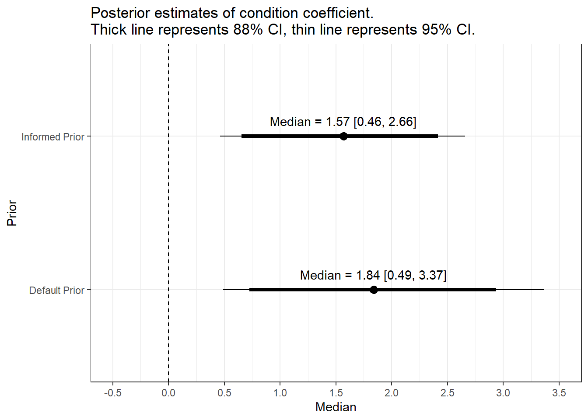

```r
library(brms) # fitting Bayesian models
library(bayestestR) # helper functions for plotting and understanding the models
library(tidybayes) # helper functions for combining plotting and tidy data from models
library(tidyverse)
library(see) # helper functions for plotting objects from bayestestR
library(emmeans) # Handy function for calculating (marginal) effect sizes
library(patchwork) # Combine multiple plots
```

# Plotting coefficients under different priors


```r
# Read informed priors model
Schroeder_1 <- read_rds("Models/Schroeder_model1.rds")

Model1_estimates <- describe_posterior(Schroeder_1, ci = c(.88, .95))

Model1_estimates <- Model1_estimates %>% 
  select(Parameter:CI_high) %>% 
  filter(Parameter == "b_CONDITION1") %>% 
  mutate(Parameter = "Condition",
         Prior = "Informed Prior") %>% 
  as.data.frame()
```


```r
# Read default priors model
Schroeder_2 <- read_rds("Models/Schroeder_model2.rds")

Model2_estimates <- describe_posterior(Schroeder_2, ci = c(.88, .95))

Model2_estimates <- Model2_estimates %>% 
  select(Parameter:CI_high) %>% 
  filter(Parameter == "b_CONDITION1") %>% 
  mutate(Parameter = "Condition",
         Prior = "Default Prior") %>% 
  as.data.frame()

estimates_data_wide <- bind_rows(Model1_estimates, Model2_estimates) %>% 
  pivot_wider(names_from = CI, values_from = CI_low:CI_high) %>% 
  mutate(text = paste0("Median = ", round(Median, 2), " [", round(CI_low_0.95, 2), ", ", round(CI_high_0.95, 2), "]"))
```


```r
estimates_data_wide %>% 
  ggplot(aes(x = Prior, y = Median, label = text)) + 
  geom_point(size = 3) + 
  geom_linerange(aes(ymin=CI_low_0.88, ymax=CI_high_0.88), linewidth = 1.5) + # 88% CI
  geom_linerange(aes(ymin=CI_low_0.95, ymax=CI_high_0.95), linewidth = 0.5) + # 95% CI
  scale_y_continuous(limits = c(-0.5, 3.5), breaks = seq(-0.5, 3.5, 0.5)) + 
  geom_text(nudge_x = 0.1) + 
  geom_hline(yintercept = 0, linetype = 2) + 
  coord_flip() + 
  labs(title = "Posterior estimates of condition coefficient. \nThick line represents 88% CI, thin line represents 95% CI.")
```



